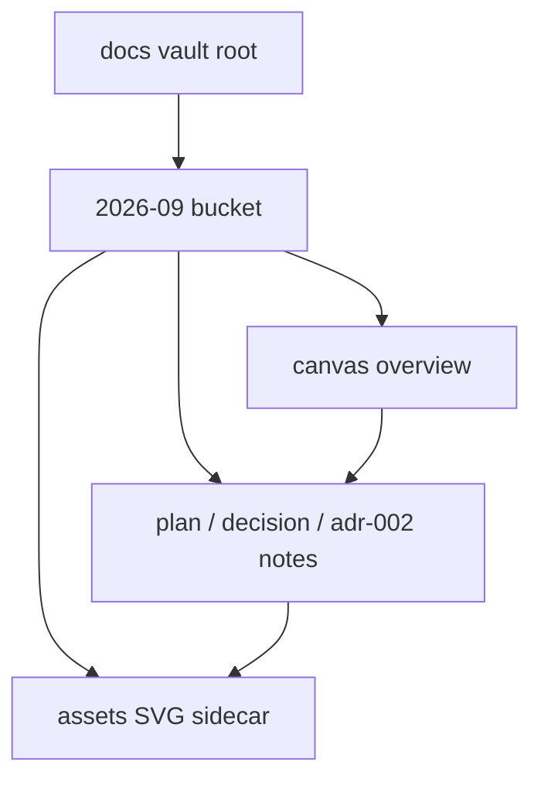
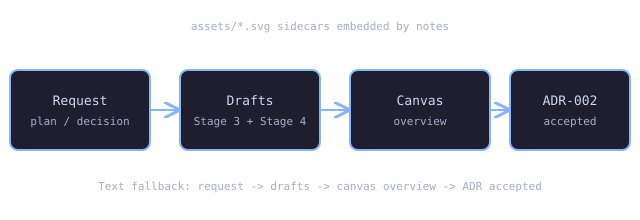

# ADR-002: Monthly bucket with co-located visual sidecars

- Status: `accepted` (on Stage 6 sign-off)
- Date: `2026-09-29`
- Deciders: orchestrator + user (Stage 3 / Stage 6 approvals)

## TL;DR

- Verdict: monthly bucket layout with canvas overview and SVG sidecars.
- Action: accepted — global ADR counter continues at 002 after legacy 001.
- Pointer: consequences and alternatives below.

## Context

Agents need a predictable, date-separated place to write plans, decisions, and ADRs that stays readable in Obsidian with plugins disabled. Legacy day-folders (`docs/2026-09-29/`, `docs/daily/`) are frozen history and must keep resolving.

## Diagram

Caption: month bucket structure.

Text fallback: vault root → month bucket → notes, canvas overview, assets; notes embed assets; canvas embeds notes.

Text fallback for the SVG: request → drafts → canvas overview → ADR accepted; sidecars in `assets/`, overview in `canvas/`.

## Decision

Use `docs/YYYY-MM/YYYY-MM-DD-<slug>-<kind>.md` (`kind`: `plan`, `decision`, `adr-NNN`), `docs/YYYY-MM/canvas/YYYY-MM-Overview.canvas`, and `docs/YYYY-MM/assets/*.{svg,excalidraw.md}`. Frontmatter carries `title,date,type,status,tags,related,slug` plus `adr/supersedes/superseded-by` and a `diagrams` list. Interactivity is core-only: wikilinks, embeds, callouts, collapsible details, Dataview-with-fallback.

## Consequences

Positive: date browsing, one-click hub/canvas reachability, lintable diagrams. Negative: month folders grow; mitigated by one canvas per month. Risks: Canvas JSON fragility (mitigated by validator parse + node check), asset orphans (mitigated by orphan check both directions), Mermaid drift (mitigated by allowlist lint).

## Alternatives considered

| Alternative | Why rejected |
| ----------- | ------------ |
| Day folders for new notes | Folder sprawl; legacy layout frozen anyway |
| Type-first folders | Breaks date-separation requirement |
| HTML/JS interactivity | Banned dependency; core-only aids suffice |

Details (prior art, rejected sketches)

Legacy ADR-001 (`docs/2026-09-29/adr-001-obsidian-docs-pipeline.md`) used day folders with full Nygard form; this ADR keeps the Nygard headings and global counter while moving new notes to the monthly bucket.

## Links

- Plan: `[[2026-09/2026-09-29-monthly-vault-plan]]`
- Decision: `[[2026-09/2026-09-29-monthly-vault-decision]]`
- Month hub: `[[2026-09/2026-09-hub|September 2026 hub]]`
- Legacy ADR-001: `[[2026-09-29/adr-001-obsidian-docs-pipeline|adr-001 (legacy)]]`
- Home: `[[Home]]`

## Draft checklist

- [x] Nygard headings present (Status/Context/Decision/Consequences/Alternatives/Links)
- [x] TL;DR ≤ 5 bullets, ≤ 60 words
- [x] Diagram has caption + text fallback
- [x] Frontmatter complete incl. `adr`, `supersedes`, `superseded-by`
- [x] Global ADR number allocated collision-safe (re-scan `adr-*`, first free NNN)
- [x] Wikilinks resolve, no absolute paths
- [x] Status flip `proposed` → `accepted` only on Stage 6 sign-off
