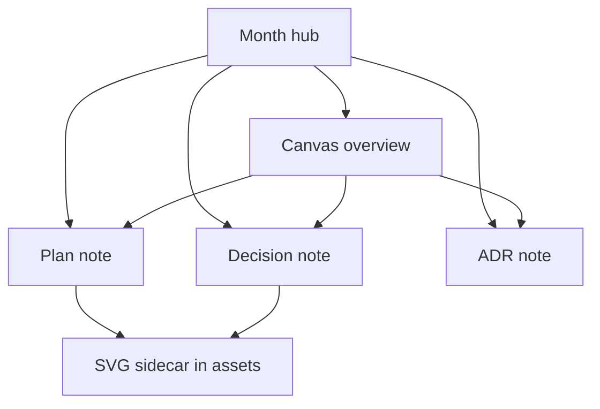

# Decision: Adopt monthly bucket with co-located visual sidecars

> Date: `2026-09-29` | Status: `approved` on Stage 6 sign-off
> Month bucket: `[[2026-09/2026-09-hub|September 2026 hub]]`

## TL;DR

- Verdict: adopted Option A — `docs/YYYY-MM/` with canvas and assets sidecars.
- Action: approved — pipeline writes here on approval gates only.
- Pointer: options table and diagram below.

## Context

The vault must separate files by date, stay readable with diagrams and interactive aids, and support an agent pipeline that writes plan, decision, and ADR docs without runtime dependencies.

## Options considered

| Option | Summary | Pros | Cons |
| ------ | ------- | ---- | ---- |
| A — Monthly bucket with co-located sidecars | Notes plus `canvas/` and `assets/` per month | Date browsing; sidecars next to notes; one canvas per month | Month folders grow |
| B — Day folders (legacy) | `docs/YYYY-MM-DD/` per day | Fine-grained | Folder sprawl; frozen as legacy |
| C — Type-first folders | `plans/`, `decisions/` flat | Groups by kind | Loses date separation; flat growth |

## Diagram

Caption: how a month slice hangs together.



Text fallback: hub links plan, decision, ADR; plan and decision embed the SVG sidecar; canvas overview embeds all three notes.

## Decision

Adopt Option A with `docs/YYYY-MM/YYYY-MM-DD-<slug>-<kind>.md` naming, `canvas/YYYY-MM-Overview.canvas` grid, and `assets/*.{svg,excalidraw.md}` sidecars. Legacy day-folders stay frozen read-only.

## Consequences

One-click month review from hub and canvas; validators enforce frontmatter, Mermaid allowlist, SVG embeds, and link integrity; writes happen only on Stage 3 / Stage 6 approvals.

<details>
<summary>Details (alternatives deep-dive)</summary>

Option B is the pre-existing layout (`docs/2026-09-29/`, `docs/daily/`, lowercase `docs/templates/`); it stays untouched for history. Option C was rejected because date separation was an explicit user requirement. ADR numbering stays global (`adr-002` here continues legacy `adr-001`).

</details>

## Links

- Plan: `[[2026-09/2026-09-29-monthly-vault-plan]]`
- ADR: `[[2026-09/2026-09-29-monthly-vault-adr-002]]`
- Month hub: `[[2026-09/2026-09-hub|September 2026 hub]]`
- Canvas: `[[2026-09/canvas/2026-09-Overview.canvas|overview canvas]]`
- Home: `[[Home]]`

## Canonical contract (verbatim)

```text
Goal: Build AI agent pipeline that writes plan, decision, ADR docs into docs/ Obsidian vault, date-separated, readable with diagrams/images/SVG and interactive Obsidian-native aids.
Scope: Scaffold docs vault per approved design v1 Option A monthly bucket, templates, naming, frontmatter, pipeline, validators, readability, checkpoint flow. Docs-only, no runtime deps.
Constraints: docs/ is vault root; open cleanly; date separation; diagram-where-helpful; core-only interactivity (no HTML/JS dep); draft->approved via status flip; legacy day-folders frozen read-only.
Inputs: User request verbatim: "I want AI agent pipeline, to write plan, decision, architecture decision in document folder(docs). assume docs folder is obsidian vault, make it support obsidian, inside docs folder, seperate file by date, I want the file is readable, contain diagram, image or svg, interactive thing to help more understand and readable" + user override "prefer option 3" + approval "approve" for design v1 Option A.
Expected output: Implemented files in docs/ + pipeline hooks + criterion-to-change/evidence mapping for VLT-01..VLT-15.
Completion criteria: All VLT-01..VLT-15 satisfiable; validators runnable; sample month slice proves layout.
Risks/ambiguities: Mermaid lint, Canvas JSON fragility, asset orphans, migration clash.
```

## Draft checklist

- [x] TL;DR ≤ 5 bullets, ≤ 60 words
- [x] Options table filled, decision cites Stage 1 verbatim
- [x] Diagram has caption + text fallback
- [x] Frontmatter complete (title, date, type, status, tags, related, slug)
- [x] Wikilinks resolve, no absolute paths
- [x] Status flip `draft` → `approved` only on Stage 6 sign-off
