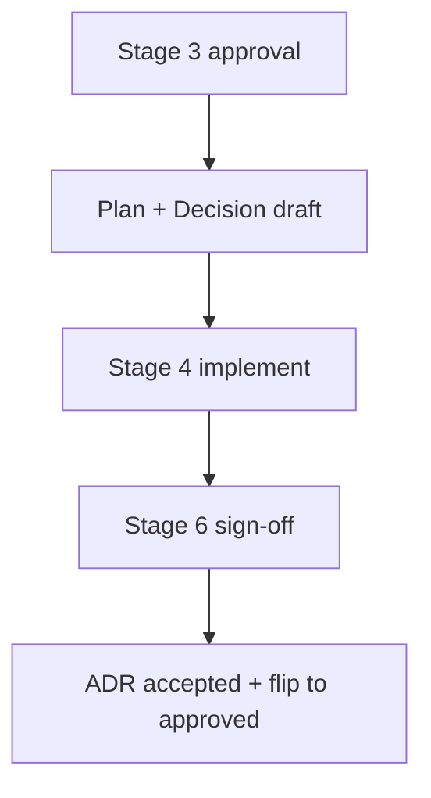

# Plan: Monthly docs vault with co-located visual sidecars

> Date: `2026-09-29` | Status: `approved` on Stage 6 sign-off
> Month bucket: `[[2026-09/2026-09-hub|September 2026 hub]]`

## TL;DR

- Verdict: monthly bucket `2026-09/` holds plan, decision, ADR-002 plus sidecars.
- Action: approved — notes are readable with diagrams and core-only aids.
- Pointer: pipeline diagram and canvas overview below.

## Goal

Build an AI-agent pipeline that writes plan, decision, and ADR docs into `docs/` as a readable, date-separated Obsidian vault.

## Context

Notes must open cleanly with plugins off, separate by date, and use diagrams, images, or SVG plus interactive Obsidian-native aids where they help understanding.

## Options

| Option | Summary | Pros | Cons |
| ------ | ------- | ---- | ---- |
| A — Monthly bucket with co-located sidecars (adopted) | `docs/YYYY-MM/` holds notes, `canvas/` overview, `assets/` SVG | One folder per month; sidecars sit next to notes | Month folders grow over time |
| B — Day folders | `docs/YYYY-MM-DD/` per day | Fine-grained days | Many folders; scatters a month |
| C — Type-first folders | `plans/`, `decisions/` with date prefixes | Groups by kind | Loses date browsing; flat dirs grow |

## Diagram

Caption: approval-gated write flow from Stage 3 to Stage 6.

Text fallback: Stage 3 approval → plan + decision drafts → implement → Stage 6 sign-off → ADR accepted and drafts flipped to approved.

Complex diagram as embedded SVG sidecar:

Text fallback for the SVG: request → plan/decision drafts → canvas overview → ADR accepted; sidecars live in `assets/`, the overview in `canvas/`.

## Plan steps

| Step | Action | Files | Criterion |
| ---- | ------ | ----- | --------- |
| 1 | Scaffold monthly bucket + hub | `docs/2026-09/`, `docs/2026-09/2026-09-hub.md` | VLT-02, VLT-03 |
| 2 | Add capital-`Templates/` with frontmatter schema | `docs/Templates/*` | VLT-04, VLT-05 |
| 3 | Add SVG sidecar + canvas overview | `docs/2026-09/assets/*`, `docs/2026-09/canvas/*` | VLT-06, VLT-08 |
| 4 | Add validators + hooks | `docs/Validators/*`, `agent/doc-writer.md` | VLT-07, VLT-14 |

## Consequences

Readable month slices with resolvable links; validators catch dangling links and bad Mermaid; legacy day-folders stay frozen read-only.

Details (Stage 1–2 background)

Option A keeps a whole month reviewable in one folder and one canvas. Co-located sidecars avoid cross-month path churn. Core-only interactivity (wikilinks, embeds, callouts, collapsible details, Dataview-with-fallback) keeps notes usable with all community plugins disabled.

## Links

- Decision: `[[2026-09/2026-09-29-monthly-vault-decision]]`
- ADR: `[[2026-09/2026-09-29-monthly-vault-adr-002]]`
- Month hub: `[[2026-09/2026-09-hub|September 2026 hub]]`
- Canvas: `[[2026-09/canvas/2026-09-Overview.canvas|overview canvas]]`
- Home: `[[Home]]`

## Draft checklist

- [x] TL;DR ≤ 5 bullets, ≤ 60 words
- [x] Diagram has caption + text fallback
- [x] Frontmatter complete (title, date, type, status, tags, related, slug)
- [x] Wikilinks resolve, no absolute paths
- [x] Status flip `draft` → `approved` only on Stage 6 sign-off
