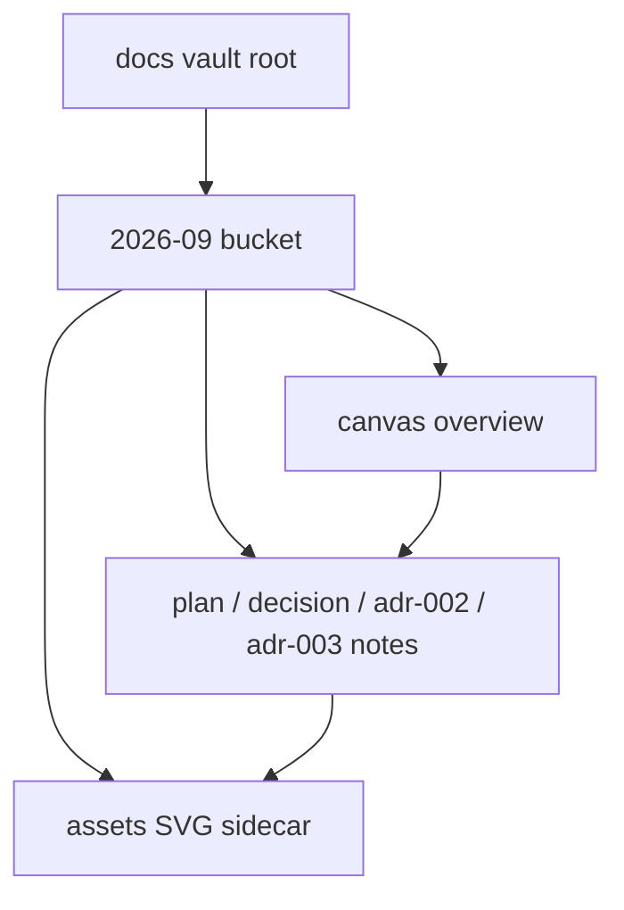

# ADR-003: Visual-first monthly vault (Option 3 / Option A)

- Status: `accepted` (on Stage 6 sign-off)
- Date: `2026-09-30`
- Deciders: orchestrator + user (Stage 3 / Stage 6 approvals)

## TL;DR

- Verdict: confirm visual-first monthly bucket (Option 3 / Option A) with canvas + SVG sidecars.
- Action: accepted — Stage 6 residuals accepted, `toml` / `js-yaml` deferred.
- Pointer: consequences, alternatives, and month hub below.

## Context

Finalize Obsidian vault docs after Stage 6 approval for the monthly vault pipeline. Monthly bucket `2026-09/` holds plan, decision, and ADR-002 plus sidecars. Legacy day folders stay frozen read-only. Stage 6 approved with residuals accepted (`toml` / `js-yaml` deferred).

Prior art: legacy ADR-001 (`[[2026-09-29/adr-001-obsidian-docs-pipeline|adr-001 (legacy)]]`) used day folders; ADR-002 (`[[2026-09/2026-09-29-monthly-vault-adr-002|ADR-002 monthly vault]]`) moved new notes to the monthly bucket with global counter continuation.

## Diagram

Caption: month bucket structure confirmed by this ADR.



Text fallback: vault root → month bucket → notes, canvas overview, assets; notes embed assets; canvas embeds notes.


Text fallback for the SVG: request → drafts → canvas overview → ADR accepted; sidecars in `assets/`, overview in `canvas/`.

## Decision

Confirm `docs/YYYY-MM/YYYY-MM-DD-<slug>-<kind>.md` (`kind`: `plan`, `decision`, `adr-NNN`), `docs/YYYY-MM/canvas/YYYY-MM-Overview.canvas`, and `docs/YYYY-MM/assets/*.{svg,excalidraw.md}`. Frontmatter carries `title,date,type,status,tags,related,slug` plus `adr/supersedes/superseded-by` and a `diagrams` list. Interactivity is core-only: wikilinks, embeds, callouts, collapsible details, Dataview-with-fallback. Visual-first: every plan/decision/ADR embeds the SVG sidecar and the month canvas links all notes.

## Consequences

Positive: date browsing, one-click hub/canvas reachability, lintable diagrams. Negative: month folders grow; mitigated by one canvas per month. Risks: Canvas JSON fragility (mitigated by validator parse + node check), asset orphans (mitigated by orphan check both directions), Mermaid drift (mitigated by allowlist lint). Counter continuation risk mitigated by global collision-safe allocation (re-scan `adr-*`, first free NNN — 003 here).

Residuals accepted at Stage 6: `toml` / `js-yaml` deferred, no block on acceptance.

## Alternatives considered

| Alternative | Why rejected |
| ----------- | ------------ |
| Day folders for new notes | Folder sprawl; legacy layout frozen anyway |
| Type-first folders | Breaks date-separation requirement |
| HTML/JS interactivity | Banned dependency; core-only aids suffice |

<details>
<summary>Details (Stage 1–2 background)</summary>

Option 3 / Option A keeps a whole month reviewable in one folder and one canvas. Co-located sidecars avoid cross-month path churn. ADR numbering stays global (`adr-003` here continues `adr-002` and legacy `adr-001`).

</details>

## Links

- Plan: `[[2026-09/2026-09-29-monthly-vault-plan]]`
- Decision: `[[2026-09/2026-09-29-monthly-vault-decision]]`
- Prior ADR: `[[2026-09/2026-09-29-monthly-vault-adr-002|ADR-002 monthly vault]]`
- Month hub: `[[2026-09/2026-09-hub|September 2026 hub]]`
- Canvas: `[[2026-09/canvas/2026-09-Overview.canvas|overview canvas]]`
- Daily: `[[daily/2026-09-30]]`
- Home: `[[Home]]`

## Canonical contract (verbatim)

```text
Goal: Finalize Obsidian vault docs after Stage 6 approval for monthly vault pipeline.
Scope: Write Nygard adr-NNN, flip plan/decision draft→approved if needed, update Home/hub/Canvas/backlinks, daily hub.
Constraints: docs/ vault root; monthly bucket; legacy frozen; never on request-changes/kill.
Inputs: Stage 6 approved with residuals accepted (toml/js-yaml deferred).
Expected output: adr file + status flips + backlink updates.
Completion criteria: ADR numbered collision-safe (next free after 002), plan/decision approved, hub/canvas list it, daily hub updated.
Risks/ambiguities: Counter continuation.
```

## Draft checklist

- [x] Nygard headings present (Status/Context/Decision/Consequences/Alternatives/Links)
- [x] TL;DR ≤ 5 bullets, ≤ 60 words
- [x] Diagram has caption + text fallback
- [x] Frontmatter complete incl. `adr`, `supersedes`, `superseded-by`
- [x] Global ADR number allocated collision-safe (re-scan `adr-*`, first free NNN)
- [x] Wikilinks resolve, no absolute paths
- [x] Status flip `proposed` → `accepted` only on Stage 6 sign-off
