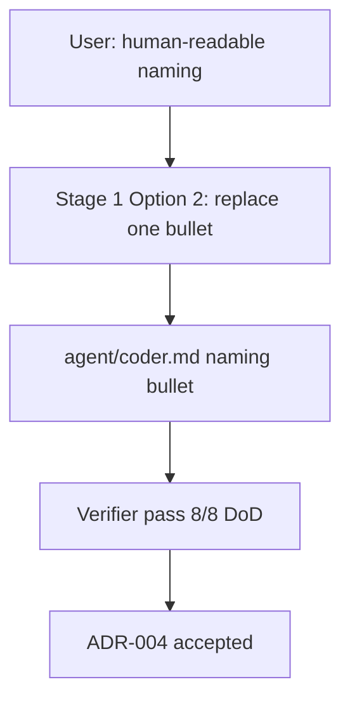

# ADR-004: Human-readable naming for coder agent

- Status: `accepted` (on Stage 6 sign-off)
- Date: `2026-10-02`
- Deciders: orchestrator + user (Stage 2.5 quick-confirm / Stage 6 approvals)

## TL;DR

- Verdict: adopt human-readable, non-technical naming guidance in `agent/coder.md`.
- Action: accepted — verifier pass 8/8 DoD, 109/109 tests, delegation/security validators pass.
- Pointer: decision, consequences, and alternatives below.

## Context

Stage 3 was skipped for this change: the Stage 2.5 trivial quick-confirm (user-approved) cleared a single-bullet edit and Stage 6 signed off the result. User request: "update coder agent to write code in human readable. variables/function/class/table name shold be non-technical name easily to understand, follow SOLID principle, DRY, best practice".

The approved design replaced exactly one logical bullet in `agent/coder.md` (Stage 1 Option 2), preserving frontmatter byte-for-byte, matching the `- **Label**: description.` convention, and reconciling the old "meaningful names" phrase. Verification: `verifier` verdict `pass`, 8/8 DoD criteria (NAM-01..NAM-06, FRONT-01, SCOPE-01); `npm test` 109/109 pass; `npm run validate:delegation` pass; `npm run validate:security` pass; review loop clean of Critical/Major with no design conflict.

## Diagram

Caption: approval path for the coder naming change.



Text fallback: user request → Stage 1 Option 2 single-bullet replacement → `agent/coder.md` naming bullet → verifier pass 8/8 → ADR-004 accepted.

## Decision

Replace the naming bullet at `agent/coder.md:285` with the approved text below (verbatim). The edit keeps the file's frontmatter byte-for-byte, keeps the `- **Label**: description.` convention, and reconciles the prior "meaningful names" wording. `agent/coder.md` is a code file outside doc-writer scope; this ADR records the already-verified change.

```text
- **Naming**: use clear, human-readable names for variables, functions,
  classes, and database tables — names a non-technical reader can understand.
  Prefer the plain-language term over an abbreviation, acronym, or internal
  jargon, and spell domain terms out rather than shortening them. When a
  domain term is genuinely the clearest and most precise name (for example
  `refund` or `invoice`), keep it and let context make it self-explanatory;
  never trade precision for vagueness, and avoid misleading or overly generic
  names such as `data`, `info`, or `temp` when a specific name exists. Keep
  functions/classes cohesive and loosely coupled.
```

## Consequences

Positive: names a non-technical reader can understand; plain language preferred over abbreviations, acronyms, and internal jargon; genuine domain terms kept for precision; cohesion and loose coupling guidance retained.

Negative/risks (residuals accepted at Stage 6): one Minor — naming-precedence ambiguity judged acceptable; one Nit — grammar; one Nit — no regression test, acceptable. VCS: `vcs: not-taken` (no commit/PR recorded for this change).

No plan or decision notes were owed: Stage 3 was skipped via the Stage 2.5 trivial quick-confirm, so there were no `draft` plan/decision frontmatter to flip. This ADR is the only note this change produces.

## Alternatives considered

| Alternative | Why rejected |
| ----------- | ------------ |
| Retain the prior "meaningful names" wording | Fails the approved human-readable, non-technical naming requirement; Option 2 replaced it. |
| Broader rewrite of the coder style guide | Out of scope; Option 2 constrained the change to exactly one logical bullet. |

<details>
<summary>Details (scope, evidence, prior art)</summary>

The change touched one logical bullet and preserved the surrounding style guide, so the blast radius was a single file. Evidence chain: approved replacement text (verbatim above) → `agent/coder.md:285` edit → `verifier` pass with 8/8 DoD → full test run 109/109 → delegation and security validators pass. Prior vault ADRs (ADR-001..ADR-003) govern the docs vault layout, not agent content, so they are not superseded by this ADR.

</details>

## Links

- Month hub: `[[2026-10/2026-10-hub|October 2026 hub]]`
- Canvas: `[[2026-10/canvas/2026-10-Overview.canvas|overview canvas]]`
- Home: `[[Home]]`

## Canonical contract (verbatim)

```text
Goal: Persist the approved change as an Obsidian ADR note and update the vault (month bucket 2026-10, hub, canvas), per the repo's monthly-bucket doc layout.
Scope: Included: create docs/2026-10/2026-10-02-coder-human-readable-naming-adr-004.md (Nygard ADR), create/update the month hub docs/2026-10/2026-10-hub.md, update the canvas docs/2026-10/canvas/2026-10-Overview.canvas, and sidecars under docs/2026-10/assets/ if needed. Excluded: the legacy (frozen read-only) layouts docs/2026-09-29/, docs/daily/, docs/templates/, docs/_index.md (additive links only); all agent/ and code files (do not modify agent/coder.md). Stage 3 skipped via the Stage 2.5 trivial quick-confirm, so there are no draft plan/decision notes to flip for this change — only the post-Stage-6 ADR is owed.
Constraints: Approval gates satisfied: Stage 3 approval equivalent (Stage 2.5 quick-confirm, user-approved) and Stage 6 sign-off (user-approved). Use vault_root: docs/, date: 2026-10-02, month: 2026-10, slug: coder-human-readable-naming, kind: adr, adr_number: 004, approved: true. ADR allocation is collision-safe: re-scan for the first free NNN and use the actual adr you return. Templates are in docs/Templates/ (including adr-template-nygard.md). Do not invent facts beyond the design/verification provided.
Inputs: The approved change and its verification. Approved replacement text (verbatim) replaced old agent/coder.md:285. Verifier verdict pass, 8/8 DoD (NAM-01..NAM-06, FRONT-01, SCOPE-01); npm test 109/109; validate:delegation pass; validate:security pass; review loop clean of Critical/Major. Residuals accepted: one Minor (naming-precedence ambiguity), one Nit (grammar), one Nit (no regression test). VCS: not-taken.
Expected output: Confirmation of files written with their paths, the actual adr number used, and the hub/canvas updates made.
Completion criteria: The ADR exists at the monthly-bucket path with the correct Nygard structure and status: approved; the month hub and canvas are updated; no legacy-frozen file is modified (additive links only).
Risks/ambiguities: If docs/2026-10/ does not yet exist, create it and a 2026-10-hub.md following the shape of the existing docs/2026-09/2026-09-hub.md. If ADR 004 collides, re-scan and report the actual number used.
```

## Draft checklist

- [x] Nygard headings present (Status/Context/Decision/Consequences/Alternatives/Links)
- [x] TL;DR ≤ 5 bullets, ≤ 60 words
- [x] Diagram has caption + text fallback
- [x] Frontmatter complete incl. `adr`, `supersedes`, `superseded-by`
- [x] Global ADR number allocated collision-safe (re-scan `adr-*`, first free NNN)
- [x] Wikilinks resolve, no absolute paths
- [x] Status flip `proposed` → `accepted` only on Stage 6 sign-off
