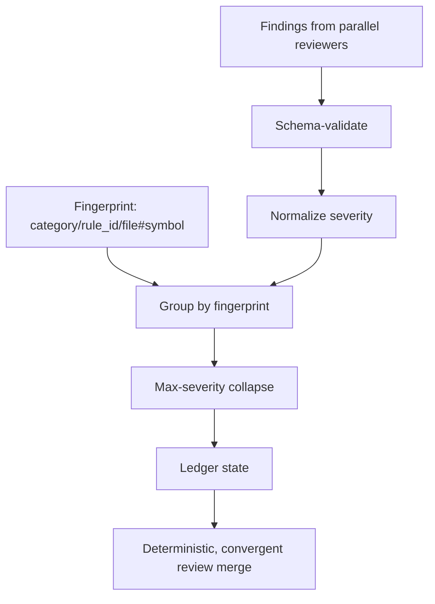

# ADR-005: Finding-identity ledger for a deterministic, convergent review stage

- Status: `accepted` (on Stage 6 sign-off)
- Date: `2026-10-02`
- Deciders: orchestrator + user (Stage 3 / Stage 6 approvals)

## TL;DR

- Verdict: adopt Option B — a pure, dependency-free arbiter makes review merge deterministic.
- Action: Stage 6 sign-off records ADR-005; AC-11 amended in place, AC-12+ added.
- Pointer: consequences and rejected alternatives below.

## Context

Repo `/home/tanutchakorn/.config/opencode`. Stage 5 merged review findings on `file:line` + free-text root cause and deduped at max severity, so nothing downstream was deterministic: no stable finding identity meant no cross-round ledger (F2), no suppression match (F3), and no trend tracking (F10), while severity dedup inflated (F5). Ten review-stage findings (F1–F10) plus three nits were identified. F1 (finding identity) is the keystone; F2/F5 are second-order; F3/F7/F10 consume both. The change ID is `review-ledger-determinism` v1, dated 2026-10-02, design Option B.

## Diagram

Caption: the canonical pipeline; the fingerprint is the sole, category-scoped merge key.



Text fallback: findings → schema-validate → normalize severity → group by fingerprint (fed by `category/rule_id/file#symbol`) → max-severity collapse → ledger state → deterministic merge.

## Decision

Adopt Option B — prompt + pure-function validator/test hybrid. `fingerprint = category/rule_id/file#symbol` (line excluded, `%`/`#`/`/` escaped) is the sole, category-scoped merge key. `scripts/review-ledger.mjs` is a pure, zero-I/O, dependency-free arbiter pinned by `tests/review-ledger.test.mjs`; the per-run ledger is an in-context fenced JSON block (KD-3); the only durable artifact is `docs/review-baseline.json` (`{version, entries}`), authored by the coder from planner entries, approver = Stage 6, mandatory expiry (KD-4). Canonical order: schema-validate → normalize severity → group by fingerprint → max-severity collapse → ledger state (KD-5). Critical secrets of any severity take a halt-and-escalate incident path, never the coder loop, and are never baseline-suppressible (KD-10). The freeze is a content digest covering tracked + untracked content (KD-6). Additive-only reviewer edits keep a byte-identical shared bullet (KD-7); AC-11 is amended in place, AC-12+ added, no renumbering (KD-8); divergence-based escalation uses a typed budget and separate finding/conflict churn (KD-9).

Key decisions KD-1..KD-10:

- KD-1: fingerprint is the sole merge key, category-scoped: `category/rule_id/file#symbol`, line excluded, normalized `file`, `%`/`#`/`/` escaped.
- KD-2: `scripts/review-ledger.mjs` is the normative, pure, zero-I/O, dependency-free arbiter; prompts restate it; parity tests enforce.
- KD-3: per-run ledger is an in-context fenced JSON block; only `docs/review-baseline.json` is durable.
- KD-4: coder authors the baseline from planner entries; approver = Stage 6; expiry mandatory.
- KD-5: canonical order - schema-validate, normalize severity, group by fingerprint, max-severity collapse, ledger state.
- KD-6: freeze is a content digest covering tracked + untracked content, captured by the verifier.
- KD-7: additive-only reviewer edits keep a byte-identical shared bullet.
- KD-8: AC-11 amended in place, AC-12+ added, no renumbering.
- KD-9: divergence-based escalation with a typed budget and separate finding/conflict churn.
- KD-10: critical secret at any severity takes the halt-and-escalate incident path, never baseline-suppressible.

## Consequences

Positive: review-stage merge, dedup, and convergence are deterministic and test-provable without a runtime store; the orchestrator stays read-only (`edit: deny` + `bash: deny`); the baseline is the single durable artifact with mandatory expiry.

Costs: a prompt/arbiter dual source of truth (mitigated by parity tests) and a new pure module plus tests under `scripts/**`/`tests/**`, so AC-11's docs-only allowlist was amended in place.

Residual Minor/Nit items accepted at Stage 6: object ledger entries with an unrecognized `state` escape the `skipped` surface; a secret could ride an identity field; `accepted` seeding is not category-guarded; freeze re-freeze lifecycle wording; several test/doc-parity and hygiene nits. VCS: `vcs: not-taken`.

<details>
<summary>Details (verification evidence, prior art)</summary>

Outcome at Stage 6: `npm test` 148/148; `validate:delegation`, `validate:security`, and `tsc --noEmit` exit 0; verifier `pass` on AC-11..AC-28; five lenses plus code-reviewer clean of Critical/Major after 8 review rounds. The scanner suite was environment-blocked (all 5 legs skipped). Prior ADRs (ADR-001..ADR-004) govern vault layout and coder naming, not review-stage determinism, so none is superseded by this ADR. No secret material is recorded; any secret would be redacted as `[REDACTED]`.

</details>

## Alternatives considered

| Alternative | Why rejected |
| ----------- | ------------ |
| Option A — prompt-only | No executable arbiter, so merge/convergence cannot be proven by tests (fails SC3/SC4). |
| Option C — runtime enforcement / external store | Violates the read-only posture and the `plugins/`/`mcp/` exclusion. |
| Option 4 — keystone-only phase | Leaves seven findings unaddressed and ships a half-migrated schema. |

## Links

- Plan: `[[2026-10/2026-10-02-review-determinism-plan]]`
- Decision: `[[2026-10/2026-10-02-review-determinism-decision]]`
- Month hub: `[[2026-10/2026-10-hub|October 2026 hub]]`
- Canvas: `[[2026-10/canvas/2026-10-Overview.canvas|overview canvas]]`
- Home: `[[Home]]`

## Canonical contract (verbatim)

```text
Goal: Write the Nygard ADR, flip the plan and decision notes from draft to approved, and update backlinks + canvas, per the doc-persistence rule (runs only after Stage 6 sign-off).
Scope: IN SCOPE: docs/2026-10/2026-10-02-review-determinism-adr-005.md (new, Nygard form, global counter), flip status: draft -> status: approved in docs/2026-10/2026-10-02-review-determinism-plan.md and ...-decision.md, update docs/2026-10/2026-10-hub.md links (remove the "deferred" markers on the ADR-005 link), and add nodes/edges to docs/2026-10/canvas/2026-10-Overview.canvas if it exists (else create it per the template). EXCLUDED: any agent/**, scripts/**, tests/** change.
Constraints: docs/ is the vault root; monthly layout; write only under docs/; YAML frontmatter (type,date,status,tags,related,slug); Nygard headings (Status/Context/Decision/Consequences/Alternatives/Links); secrets redacted as [REDACTED]. ADR allocation is collision-safe: proposed adr_number: 5 (max existing is adr-004); re-scan for the first free NNN on collision and return the actual adr.
Inputs: The approved design + final outcome below; date 2026-10-02, month 2026-10, slug review-determinism.
Expected output: Files created/updated, with the actual adr number returned.
Completion criteria: ADR exists at ...-adr-005.md with Nygard headings; plan/decision flipped to approved; hub link resolved; canvas updated; all under docs/.
Risks/ambiguities: If a canvas file does not exist, create it from the monthly-overview template; do not touch legacy frozen paths.
```

## Draft checklist

- [x] Nygard headings present (Status/Context/Decision/Consequences/Alternatives/Links)
- [x] TL;DR ≤ 5 bullets, ≤ 60 words
- [x] Diagram has caption + text fallback
- [x] Frontmatter complete incl. `adr`, `supersedes`, `superseded-by`
- [x] Global ADR number allocated collision-safe (re-scan `adr-*`, first free NNN)
- [x] Wikilinks resolve, no absolute paths
- [x] Status flip `proposed` → `accepted` only on Stage 6 sign-off
