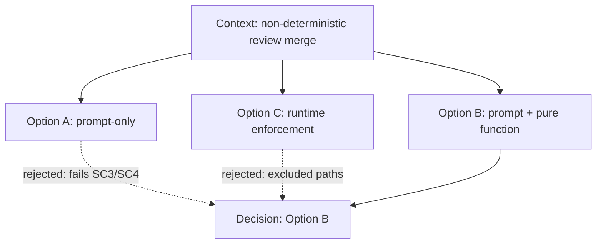

# Decision: Review-stage determinism — Option B (pure-function arbiter)

> Date: `2026-10-02` | Status: `approved` (Stage 6 sign-off recorded by [[2026-10/2026-10-02-review-determinism-adr-005|ADR-005]])
> Month bucket: `[[2026-10/2026-10-hub|month hub]]`

## TL;DR

- Verdict: Option B chosen — prompt plus pure-function validator/test hybrid, fingerprint the sole merge key.
- Action: unblocks implementation across `agent/**`, `scripts/**`, `tests/**`, `docs/**`.
- Pointer: rationale and rejected alternatives below; ADR-005 accepted at Stage 6.

## Context

Stage 5 merges findings on `file:line` + free-text root cause and dedups at max severity, so nothing downstream is deterministic: no stable finding identity means no cross-round ledger (F2), no suppression match (F3), and no trend tracking (F10), and severity dedup inflates (F5). F1 (finding identity) is the keystone; F2/F5 are second-order; F3/F7/F10 depend on both. The change ID is `review-ledger-determinism`, revision v1, dated 2026-10-02, in repo `/home/tanutchakorn/.config/opencode`.

## Options considered

| Option | Summary | Pros | Cons |
| ------ | ------- | ---- | ---- |
| A — Prompt-only | Fingerprint + merge rules live in reviewer prompts only. | No new runtime code; smallest diff. | No executable arbiter; fails SC3/SC4. |
| 2 — Prompt + pure-function validator/test hybrid | Pure ESM function is normative; prompts restate it; parity tests enforce. | Deterministic, test-provable merge/convergence (SC2/SC3/SC4); fits `edit: deny` + `bash: deny`. | New `scripts/**` + `tests/**`; parity maintenance. |
| C — Runtime enforcement | Enforce merge in the orchestrator runtime. | Strongest runtime guarantee. | Violates excluded paths; orchestrator is read-only. |

## Diagram

Caption: the three options converge on Option B; A and C are rejected.



Text fallback: context → options A/B/C; A rejected (no executable arbiter, fails SC3/SC4), C rejected (violates excluded paths, read-only orchestrator), B chosen.

## Decision

Adopt Option B — prompt + pure-function validator/test hybrid. It is the only option satisfying deterministic, test-provable merge/convergence (SC2/SC3/SC4) while the orchestrator stays `edit: deny` + `bash: deny` and the change stays inside `agent/**`, `docs/**`, `scripts/**`, `tests/**`. Rejected: Option A (prompt-only — no executable arbiter, fails SC3/SC4) and Option C (runtime enforcement — violates excluded paths, orchestrator read-only).

Key decisions KD-1..KD-10:

- KD-1: fingerprint is the sole merge key, category-scoped: `fingerprint = category/rule_id/file#symbol`, line excluded, normalized `file`.
- KD-2: the pure function is the normative arbiter; prompts restate it; parity tests enforce.
- KD-3: per-run ledger in-context; only `docs/review-baseline.json` is durable.
- KD-4: coder authors the baseline from planner entries; approver = Stage 6; expiry mandatory.
- KD-5: canonical order — schema-validate → normalize severity → group by fingerprint → max-severity collapse → ledger state.
- KD-6: freeze SHA captured by verifier, passed to all parallel reviewers.
- KD-7: additive-only reviewer edits (byte-identical shared bullet).
- KD-8: AC-11 amended in place, AC-12+ new, no renumber.
- KD-9: divergence escalation + loop budget + separate finding/conflict churn.
- KD-10: any-severity secret → incident path (rotate/purge/`.scans/` ignore), never the coder loop.

## Consequences

Positive: deterministic finding identity makes merge, suppression, and trend tracking reproducible and test-provable; prompts and the pure function stay in lockstep via parity tests; the orchestrator remains read-only.

Risks/ambiguities: prompt/function drift (mitigated by parity tests); the month canvas update and ADR-005 are deferred to Stage 6; `risk: medium`, `auto_approve: false`. No secret material is recorded; any secret would be redacted as `[REDACTED]`.

<details>
<summary>Details (alternatives deep-dive)</summary>

Option A loses because no executable arbiter exists, so merge and convergence cannot be proven by tests (SC3/SC4). Option C loses because runtime enforcement would require touching excluded paths and violates the orchestrator's read-only, `edit: deny` + `bash: deny` constraint. Option B keeps the decision testable and the blast radius inside the four allowed path families, at the cost of a new pure ESM module and a parity test suite.

</details>

## Links

- Plan: `[[2026-10/2026-10-02-review-determinism-plan]]`
- ADR: `[[2026-10/2026-10-02-review-determinism-adr-005]]` (accepted at Stage 6)
- Month hub: `[[2026-10/2026-10-hub|month hub]]`
- Home: `[[Home]]`

## Canonical contract (verbatim)

```text
Goal: Write the approved `plan` and `decision` notes for the review-stage determinism change in `docs/2026-10/` with `status: draft`, and update the month hub.
Scope: IN SCOPE: `docs/2026-10/2026-10-02-review-determinism-plan.md` (new), `docs/2026-10/2026-10-02-review-determinism-decision.md` (new), and the month hub `docs/2026-10/2026-10-hub.md` (add links). Follow `docs/Templates/plan-template.md` and `docs/Templates/decision-template.md`. EXCLUDED: ADR, canvas, backlinks flip to approved, and any `agent/**`, `scripts/**`, `tests/**` change (those happen later).
Constraints: `docs/` is the vault root; monthly-bucket layout is current; legacy day layout is frozen read-only. Notes carry YAML frontmatter (`type,date,status,tags,related,slug`); `status: draft` for both. Redact any secret as `[REDACTED]`. Do not write outside `docs/`.
Inputs: The approved design doc v1 (verbatim), plus the user's original request "plan fix them all".
Expected output: The two notes created and the hub updated, then a short confirmation listing the paths written.
Completion criteria: Both notes exist at the exact paths, have valid frontmatter with `status: draft`, follow their templates, cross-link each other, and the month hub lists them.
Risks/ambiguities: If a monthly canvas or ADR counter is expected, note that ADR NNN=5 is deferred to Stage 6.
```

## Draft checklist

- [ ] TL;DR ≤ 5 bullets, ≤ 60 words
- [ ] Options table filled, decision cites Stage 1 verbatim
- [ ] Diagram has caption + text fallback
- [ ] Frontmatter complete (title, date, type, status, tags, related, slug)
- [ ] Wikilinks resolve, no absolute paths
- [ ] Status flip `draft` → `approved` only on Stage 6 sign-off
