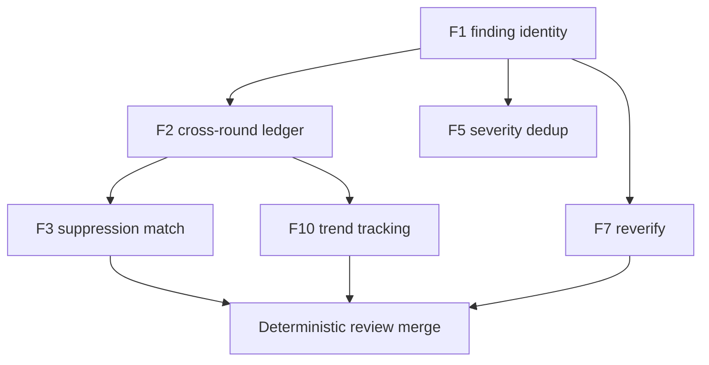

# Plan: Review-stage determinism (finding identity + deterministic merge)

> Date: `2026-10-02` | Status: `approved` (Stage 6 sign-off recorded by [[2026-10/2026-10-02-review-determinism-adr-005|ADR-005]])
> Month bucket: `[[2026-10/2026-10-hub|month hub]]`

## TL;DR

- Verdict: adopt Option B — a prompt plus pure-function validator/test hybrid to make review merge deterministic.
- Action: approval unblocks implementing F1 first, then F2/F5, then F3/F7/F10, then the rest.
- Pointer: options, plan steps, and the DoD checklist below; ADR-005 accepted at Stage 6.

## Goal

Write the approved plan for the review-stage determinism change (`review-ledger-determinism`, revision v1) in the `2026-10` month bucket, with `status: draft`, and update the month hub.

## Context

Stage 5 currently merges findings on `file:line` + free-text root cause and dedups at max severity. Nothing downstream is deterministic: no stable finding identity means no cross-round ledger (F2), no suppression match (F3), and no trend tracking (F10), while severity dedup inflates (F5). F1 (finding identity) is the keystone; F2/F5 are second-order; F3/F7/F10 depend on both.

The approved design (v1, 2026-10-02) resolves this with Option B — a pure-function validator as the normative merge arbiter, with prompts restating it and parity tests enforcing agreement.

## Options

| Option | Summary | Pros | Cons |
| ------ | ------- | ---- | ---- |
| A — Prompt-only | Encode fingerprint + merge rules in reviewer prompts only. | No new runtime code; smallest diff. | No executable arbiter; fails SC3/SC4 (test-provable merge/convergence). |
| 2 — Prompt + pure-function validator/test hybrid | Pure ESM function is normative; prompts restate it; parity tests enforce. | Deterministic, test-provable merge/convergence (SC2/SC3/SC4); fits orchestrator `edit: deny` + `bash: deny`. | Requires new `scripts/**` + `tests/**`; prompts must stay in sync (parity tests). |
| C — Runtime enforcement | Enforce merge inside the orchestrator runtime. | Strongest guarantee at runtime. | Violates excluded paths and the read-only orchestrator constraint. |

## Diagram

Caption: F1 is the keystone; F2/F5 are second-order, and F3/F7/F10 all consume F1 + F2.

Text fallback: F1 (finding identity) → F2 (ledger) → F3 (suppression) and F10 (trends); F1 also feeds F5 (severity dedup) and F7 (reverify); F3/F7/F10 converge on deterministic review merge.

## Plan steps

Implementation order: F1 → F2/F5 → F3/F7/F10 → F4/F6/F8/F9 → nits.

| Step | Action | Files | Criterion |
| ---- | ------ | ----- | --------- |
| 1 | Freeze the fingerprint schema and pure function (F1). | `agent/finding-schema.md`, `scripts/review-ledger.mjs` | AC-12, AC-14 |
| 2 | Add ledger state + normalize severity before max-dedup (F2/F5). | `scripts/review-ledger.mjs`, `tests/review-ledger.test.mjs`, `tests/fixtures/review-ledger-findings.json` | AC-15, AC-16, AC-17 |
| 3 | Wire baseline + suppression + reverify + trends (F3/F7/F10). | `docs/review-baseline.json`, `agent/code-orchestrator.md` | AC-18, AC-21 |
| 4 | Scan-delta + incident path + not-verifiable + divergence (F4/F6/F8/F9). | `agent/code-security-scanner.md`, `agent/verifier.md`, `agent/delegation-contract.md` | AC-19, AC-22, AC-23, AC-24 |
| 5 | Add the byte-identical finding-schema bullet + governance text. | six `*-reviewer.md`, `agent/delegation-contract.md`, `docs/ai-agent-pipeline.md` | AC-13, AC-26 |
| 6 | Nits + `npm test` green, no secret material. | `tests/**` | AC-27, AC-28 |

## Consequences

Positive: deterministic finding identity makes merge, suppression, and trend tracking reproducible; parity tests keep prompts and the pure function in lockstep; the change stays inside `agent/**`, `docs/**`, `scripts/**`, `tests/**` with the orchestrator still `edit: deny` + `bash: deny`.

Risks/ambiguities: prompts can drift from the pure function (mitigated by parity tests); a monthly canvas update and ADR-005 are deferred to Stage 6; `risk: medium`, `auto_approve: false`.

Details (Stage 1–2 background)

Key decisions KD-1..KD-10: fingerprint is the sole merge key, category-scoped (`category/rule_id/file#symbol`, line excluded, normalized `file`); the pure function is the normative arbiter with prompt parity tests; the ledger is per-run in-context while only `docs/review-baseline.json` is durable; the coder authors the baseline from planner entries and Stage 6 is the approver, expiry mandatory; canonical order is schema-validate → normalize severity → group by fingerprint → max-severity collapse → ledger state; the verifier captures a freeze SHA passed to all parallel reviewers; reviewer edits are additive-only (byte-identical shared bullet); AC-11 is amended in place and AC-12+ added without renumbering; divergence uses escalation + loop budget with separate finding/conflict churn; a secret at any severity takes the incident path (rotate/purge/`.scans/` ignore), never the coder loop.

## Links

- Decision: `[[2026-10/2026-10-02-review-determinism-decision]]`
- ADR: `[[2026-10/2026-10-02-review-determinism-adr-005]]` (accepted at Stage 6)
- Month hub: `[[2026-10/2026-10-hub|month hub]]`
- Home: `[[Home]]`

## Draft checklist

- [ ] TL;DR ≤ 5 bullets, ≤ 60 words
- [ ] Diagram has caption + text fallback
- [ ] Frontmatter complete (title, date, type, status, tags, related, slug)
- [ ] Wikilinks resolve, no absolute paths
- [ ] Status flip `draft` → `approved` only on Stage 6 sign-off
