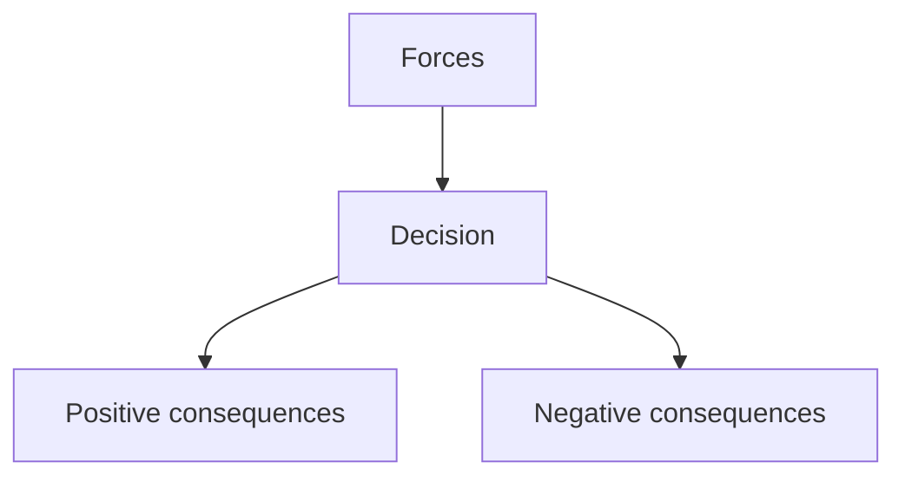

# ADR-NNN: <Title>

- Status: `proposed` → `accepted` (on Stage 6 sign-off) / `superseded by ADR-MMM`
- Date: `{{date:YYYY-MM-DD}}`
- Deciders: orchestrator + user (Stage 3 / Stage 6 approvals)

## TL;DR

- Verdict: <decision in one line>.
- Action: <what sign-off records>.
- Pointer: <which section holds consequences>.

## Context

<forces, constraints, Stage 1–2 background>

## Diagram

Caption: <what the diagram shows>.

Text fallback: forces → decision → positive / negative consequences.

## Decision

<what was decided, architecture + key decisions>

## Consequences

<positive / negative / risks + mitigations>

## Alternatives considered

| Alternative | Why rejected |
| ----------- | ------------ |
| | |

Details (prior art, rejected sketches)

<deeper background>

## Links

- Plan: `[[{{date:YYYY-MM}}/{{date:YYYY-MM-DD}}-<slug>-plan]]`
- Decision: `[[{{date:YYYY-MM}}/{{date:YYYY-MM-DD}}-<slug>-decision]]`
- Month hub: `[[{{date:YYYY-MM}}/{{date:YYYY-MM}}-hub|month hub]]`
- Home: `[[Home]]`

## Draft checklist

- [ ] Nygard headings present (Status/Context/Decision/Consequences/Alternatives/Links)
- [ ] TL;DR ≤ 5 bullets, ≤ 60 words
- [ ] Diagram has caption + text fallback
- [ ] Frontmatter complete incl. `adr`, `supersedes`, `superseded-by`
- [ ] Global ADR number allocated collision-safe (re-scan `adr-*`, first free NNN)
- [ ] Wikilinks resolve, no absolute paths
- [ ] Status flip `proposed` → `accepted` only on Stage 6 sign-off
