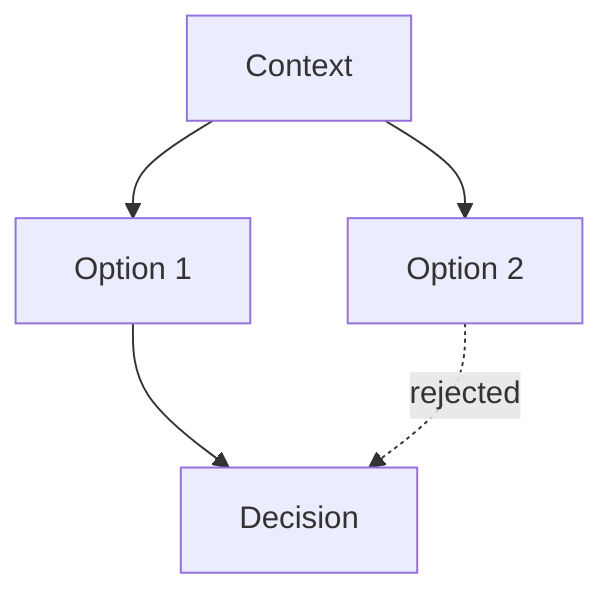

# Decision: <Title>

> Date: `{{date:YYYY-MM-DD}}` | Status: `draft` → `approved` on Stage 6 sign-off
> Month bucket: `[[{{date:YYYY-MM}}/{{date:YYYY-MM}}-hub|month hub]]`

## TL;DR

- Verdict: <chosen option in one line>.
- Action: <what approval unblocks>.
- Pointer: <where rationale lives>.

## Context

<why this decision was needed, Stage 1 summary>

## Options considered

| Option | Summary | Pros | Cons |
| ------ | ------- | ---- | ---- |
| 1 — <Title> | | | |
| 2 — <Title> | | | |

## Diagram

Caption: <what the diagram shows>.



Text fallback: context → options → decision (loser marked rejected).

## Decision

<chosen option + rationale, Stage 1 Recommendation verbatim>

## Consequences

<what follows, risks/ambiguities>

<details>
<summary>Details (alternatives deep-dive)</summary>

<why rejected options lost, effort/risk notes>

</details>

## Links

- Plan: `[[{{date:YYYY-MM}}/{{date:YYYY-MM-DD}}-<slug>-plan]]`
- ADR: `[[{{date:YYYY-MM}}/{{date:YYYY-MM-DD}}-<slug>-adr-NNN]]`
- Month hub: `[[{{date:YYYY-MM}}/{{date:YYYY-MM}}-hub|month hub]]`
- Home: `[[Home]]`

## Canonical contract (verbatim)

```text
Goal:
Scope:
Constraints:
Inputs:
Expected output:
Completion criteria:
Risks/ambiguities:
```

## Draft checklist

- [ ] TL;DR ≤ 5 bullets, ≤ 60 words
- [ ] Options table filled, decision cites Stage 1 verbatim
- [ ] Diagram has caption + text fallback
- [ ] Frontmatter complete (title, date, type, status, tags, related, slug)
- [ ] Wikilinks resolve, no absolute paths
- [ ] Status flip `draft` → `approved` only on Stage 6 sign-off
