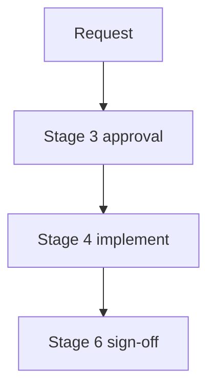

# Plan: <Title>

> Date: `{{date:YYYY-MM-DD}}` | Status: `draft` → `approved` on Stage 6 sign-off
> Month bucket: `[[{{date:YYYY-MM}}/{{date:YYYY-MM}}-hub|month hub]]`

## TL;DR

- Verdict: <one line>.
- Action: <what approval unblocks>.
- Pointer: <where detail lives>.

## Goal

<one-line goal from 7-field contract>

## Context

<why this plan exists, Stage 1 summary>

## Options

| Option | Summary | Pros | Cons |
| ------ | ------- | ---- | ---- |
| 1 — <Title> | | | |
| 2 — <Title> | | | |

## Diagram

Caption: <what the diagram shows>.

Text fallback: request → Stage 3 approval → Stage 4 implement → Stage 6 sign-off.

## Plan steps

| Step | Action | Files | Criterion |
| ---- | ------ | ----- | --------- |
| 1 | | | |

## Consequences

<what follows, risks/ambiguities>

Details (Stage 1–2 background)

<fuller background, tradeoffs, rejected options>

## Links

- Decision: `[[{{date:YYYY-MM}}/{{date:YYYY-MM-DD}}-<slug>-decision]]`
- ADR: `[[{{date:YYYY-MM}}/{{date:YYYY-MM-DD}}-<slug>-adr-NNN]]` (after Stage 6)
- Month hub: `[[{{date:YYYY-MM}}/{{date:YYYY-MM}}-hub|month hub]]`
- Home: `[[Home]]`

## Draft checklist

- [ ] TL;DR ≤ 5 bullets, ≤ 60 words
- [ ] Diagram has caption + text fallback
- [ ] Frontmatter complete (title, date, type, status, tags, related, slug)
- [ ] Wikilinks resolve, no absolute paths
- [ ] Status flip `draft` → `approved` only on Stage 6 sign-off
