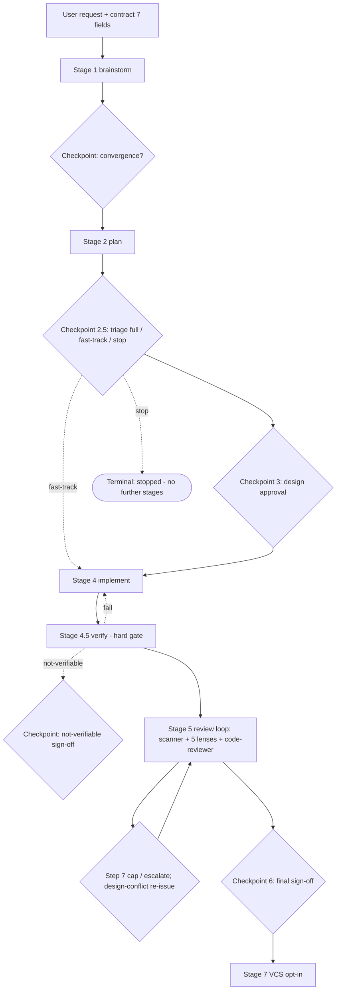

# Orchestrator Review — Hybrid 3+4

## Diagram: intake → review-loop (stages, checkpoints, handoffs)



Handoffs: Decision & requirements → design doc v1 → approved plan → criterion mapping → verifier verdict → merged findings → sign-off. Checkpoints are blocking via question tool: Stage 1 convergence, 2.5 triage, 3 approval, 4.5 not-verifiable, 5 step-7 escalation, 6 final sign-off. Edges: S45 fail→S4 rework, S45 not-verifiable→blocking checkpoint sign-off (no silent advance to S5); C25 fast-track→S4 (skips full-plan path but still requires 4.5+5+6), C25 stop→terminal (pipeline ends, no further stages).

## Layer 1 — Verdict summary

Orchestrator pipeline is well-gated: verbatim contracts, independent verify, 5-lens + scanner review loop, explicit checkpoints.
Strengths: hard 4.5 gate, criterion-ID governance, design-conflict routing, blocking human sign-offs.
Gaps: long prompt (~758 lines) risks drift; length caps vs completeness tension; heavy loop cost at ~3 passes.
Verdict: keep Hybrid 3+4 shape; single review doc; no runtime changes.

## Layer 2 — Per-stage analysis keyed to 7 handoff fields

| Stage | Goal | Scope | Constraints | Inputs | Expected output | Completion criteria | Risks/ambiguities |
|---|---|---|---|---|---|---|---|
| Intake | Capture request + build canonical contract | In: request, context; Out: 7 fields | Preserve Inputs verbatim; never rename fields | User request text | Contract with Goal, Scope, Constraints, Inputs, Expected output, Completion criteria, Risks/ambiguities | All 7 fields present | Vague requests; secret pasted in Inputs → redact |
| 1 Brainstorm | Converge decision + requirements | brainstormer rounds; options catalog | Verbatim pass-through Options→Comparison→Recommendation; ≤3 re-delegates per gap | Contract | Decision & requirements handoff with catalog, comparison, recommendation | Converged or best-effort decision | Non-convergence; pagination overflow |
| 2 Plan | Design doc actionable by coder | code-planner; files-to-touch, risks | Read-only planner; pass Stage 1 verbatim | Stage 1 handoff verbatim | Design doc v1 + DoD checklist | Design complete, IDs stable | Incomplete design; auto_approve flip |
| 2.5 Triage | Route full / fast-track / stop | Orchestrator branch | Trivial still requires 4.5+5+6; denylist forces full | Design doc + risk/auto_approve | Recorded routing decision | Route closed explicitly | Mis-triage of risky change |
| 3 Approval | Explicit user approval before code | question-tool checkpoint | Blocking; re-plan on changes; delegation timeout with backoff, retry transient failures only, retries do not consume outer pass | Design + plan table + tradeoffs | Approve / request-changes | Approval recorded | Stall/timeout; silent proceed forbidden; blocking-checkpoint deadline: nudge on timeout, abandon after repeated no-response with recorded stop |
| 4 Implement | Implement approved design delta | coder; Stages 1–3 context + active checklist verbatim | No unapproved deviations; flag DESIGN_CONFLICT; delegation timeout with backoff, retry transient failures only, retries do not consume outer pass | Approved design + DoD verbatim | Criterion-to-change/evidence mapping | Every criterion mapped | Scope creep; conflict misrouted to coder |
| 4.5 Verify | Independent verification gate | verifier; DoD verbatim + coder handoff | Never trust coder self-report; fail blocks Stage 5; fail→S4 rework, not-verifiable→blocking checkpoint; delegation timeout with backoff, retry transient failures only, retries do not consume outer pass | Coder handoff + DoD | Verdict pass/fail/not-verifiable + evidence | pass with evidence per criterion | not-verifiable without sign-off; no-tooling misuse |
| 5 Review loop | Iterate until clean | Scanner once/pass + 5 lenses + code-reviewer + coder + verifier | Loop until no Critical/Major + reviewer clean + verify pass; ~3-pass cap then escalate; delegation timeout with backoff, retry transient failures only, retries do not consume outer pass | Verified diff + latest design | Clean diff or escalation | All gates clean + sign-offs | Loop cost; conflict vs fix misrouting |
| 6 Sign-off | Final human acceptance | question-tool; diff + verdicts + residual Minor/Nit | Loop-clean is not completion; vcs: not-taken here | Mapping + verdicts + residuals | Approve-and-finish / request-changes | Approval + residual acceptance | Accepting live secrets; vague approval; blocking-checkpoint deadline: nudge on timeout, abandon after repeated no-response with recorded stop |
| 7 VCS opt-in | Optional commit/push | vcs-committer only post-6 | Explicit paths; per-step ask; no retry on deny | Stage 6 approval + VCS request | vcs: done sha / denied / not-taken | Outcome stated in report | Denial handling; accidental -a/. commit |

## Layer 3 — Options catalog + concept deep-dives + risks

### Options catalog

- **Option 1 — Single comprehensive doc (adopted element):** What-it-does: one markdown review file. Summary: Single file keeps cross-links, diagram, layers, and appendix together; easy to verify AC-01..AC-09 in one pass. Pros: atomic delivery; no split-brain. Cons: long file. Effort/risk: low.
- **Option 2 — Per-stage docs:** What-it-does: one file per stage. Summary: Splits length but scatters criterion mapping and verbatim appendix across files. Pros: shorter pages. Cons: harder single-shot verification; link rot. Effort/risk: medium. Rejected: breaks single-shot complete delivery.
- **Option 3 — Layered single doc with diagram + L1–L3 (Hybrid-3 element, adopted):** What-it-does: diagram, concise L1, keyed L2 tables, full L3. Summary: Satisfies AC-01/02/03/06/07 with bounded L1 and unbounded detail in L3. Pros: meets caps and completeness. Cons: requires discipline on L1 length. Effort/risk: low.
- **Option 4 — Verbatim appendix + evidence mapping (Hybrid-4 element, adopted):** What-it-does: appendix reproduces brainstorm decision and 7-field contract verbatim plus AC mapping. Summary: Preserves handoff structure byte-for-byte so AC-04/05/08 pass mechanically. Pros: auditability; no mutation risk. Cons: duplicates text; longer file. Effort/risk: low.
- **Option 5 — Diagram-only + pointers:** What-it-does: diagram with links to source files instead of prose. Summary: Shortest doc but fails L2/L3 coverage. Pros: minimal length. Cons: misses AC-03/06/07. Effort/risk: low. Rejected: incomplete.

Comparison: Options 3+4 combine into Hybrid 3+4: layered detail plus verbatim fidelity in one file; Options 2 and 5 rejected for splitting delivery and dropping coverage. Recommendation: Hybrid 3+4 as specified in design v1.

### Concept deep-dives

- **Canonical contract (7 fields):** immutable context carried on every delegation; field names stable; Inputs preserves user original; planner owns criterion IDs; coder maps, verifier checks pass/fail/not-verifiable.
- **Checkpoints (blocking):** Stage 1 convergence, 2.5 triage, 3 approval, 4.5 not-verifiable, 5 step-7 escalation, 6 sign-off — all via question tool; silence never counts as approval.
- **Handoffs:** Decision & requirements → design v1 → approved plan → mapping → verdict → merged findings → sign-off; each stage feeds the next verbatim.
- **Independent verification:** Stage 4.5/5/6 verifier gate with DoD verbatim; coder self-report never authoritative; fail blocks advance.
- **Review loop:** outer passes (scanner once + 5 lenses + code-reviewer) × inner fix+verify rounds; dedup at max severity; ~3-pass cap then user escalation.
- **Design-conflict routing:** conflicts against Decision/Architecture/Key decisions go coalesced to planner as versioned revision with re-approval; non-conflicts go to coder.
- **Criterion-ID governance:** amend in place, withdrawn with reason, new IDs continue numbering, never renumber; active checklist = latest non-withdrawn.
- **Communication format:** four parts Overview/Non-technical/Technical/Summary in order, receipt line, next-step card, per-finding dual explanation, tiered evidence, Tier 1–3 formatting.

### Risks / mitigations

- **Length vs completeness:** mitigated by L1 ≤10-line cap with full detail paginated into L2/L3 and appendix; caps paginate, never truncate or drop verbatim.
- **Prompt drift (758-line orchestrator):** mitigated by single-doc review pinning field names, stage order, and checkpoint semantics.
- **Loop cost:** mitigated by ~3-pass cap with escalation and coalesced design-conflict re-issues counting as passes.
- **Secret leakage in verbatim quotes:** mitigated by redaction rule ([redacted: secret — see file:line + rule ID]) and no-repeat of live secrets.
- **Mis-triage / silent advance:** mitigated by blocking question-tool checkpoints and denylist forcing full pipeline.
- **Blocking-checkpoint stall (Stage 3 / Stage 6):** mitigated by explicit deadline per checkpoint with timeout nudge and abandon-after-repeated-no-response recorded as stop; silence never counts as approval.
- **Delegation transient failure:** mitigated by delegation timeout with exponential backoff, retry of retryable transient errors only, retries logged and not counted against the outer ~3-pass cap.

## Appendix — Verbatim passages (do not edit)

### A. Brainstorm decision (verbatim)

```text
Decision: Adopt Hybrid 3+4 — layered single-doc review (Option 3) plus verbatim appendix with evidence mapping (Option 4).
Rationale: Layered shape satisfies length caps while preserving completeness; verbatim appendix preserves handoff structure.
Rejected: Option 2 (per-stage docs split single-shot delivery); Option 5 (diagram-only drops L2/L3 coverage).
Next steps: Planner emits design v1 for docs/orchestrator-review-hybrid34.md with (a) diagram, (b) L1, (c) L2 per-stage keyed tables, (d) L3 catalog + deep-dives + risks, appendix verbatim.
```

### B. Canonical contract — 7 fields (verbatim)

```text
Goal: Review orchestrator agent, show detail about all options, concepts
Scope: Orchestrator pipeline, stages, checkpoints, handoffs
Constraints: Preserve verbatim handoff structure; Hybrid 3+4 shape
Inputs: User request + approval Hybrid 3+4
Expected output: Fixed review doc
Completion criteria: No Critical/Major remain, all AC pass
Risks/ambiguities: Length caps vs completeness
```

Note: Appendix B reproduces the planner canonical contract byte-for-byte for AC-05; lens-specific review delegations use their own lens-scoped Expected output / Completion criteria, which intentionally differ from this canonical contract.

### C. Planner acceptance checklist DoD (verbatim)

```text
AC-01 Diagram present covering intake→review-loop with stages, checkpoints, handoffs
AC-02 Layer 1 verdict summary ≤10 lines with strengths/gaps
AC-03 Layer 2 covers every stage keyed to all 7 handoff fields
AC-04 Brainstorm decision reproduced verbatim
AC-05 Contract 7 fields reproduced verbatim
AC-06 Layer 3 full Options catalog + concept deep-dives present
AC-07 Risks/mitigations incl. length-vs-completeness addressed
AC-08 No unauthorized mutations
AC-09 Single-shot complete delivery
```

### D. Approved design v1 (verbatim)

```text
Approved design v1: single markdown review doc docs/orchestrator-review-hybrid34.md with (a) diagram, (b) L1, (c) L2 per-stage keyed tables, (d) L3 catalog + deep-dives + risks, appendix verbatim.
```
