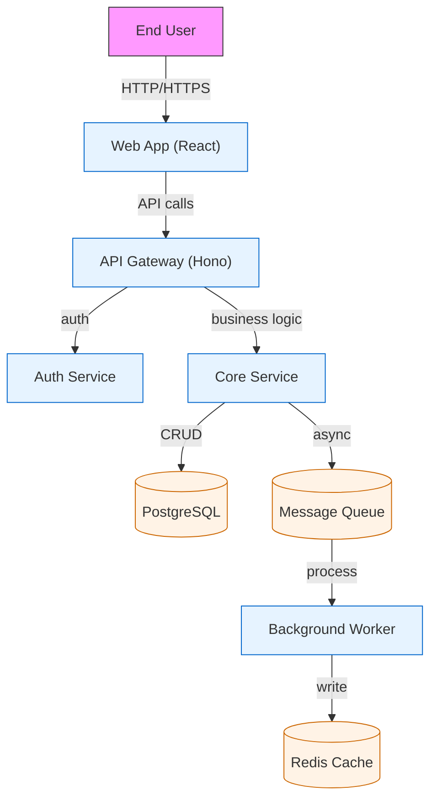
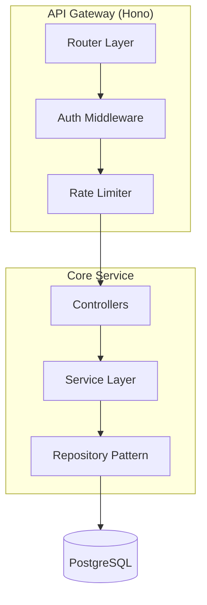

---
name: architecture-workflow
description: Use this skill when the user asks for architecture design, system design, architectural decisions, high-level technical planning, C4 diagrams, trade-off analysis between architectural patterns (microservices vs monolith, etc.), or creating Architecture Decision Records (ADRs). Also use it when the user says "design the system", "architect this", "what architecture should I use", "plan the architecture", "ADR", "system architecture diagram", or any request about structuring a software system at the component/service/module level. Do NOT use this skill for simple implementation planning (use plan-describe instead) or for brainstorming (use plan-brainstorm instead).

compatibility:
  tools:
    - read
    - write
    - edit
    - bash
    - glob
    - grep
  skills:
    - code-philosophy (load for architecture alignment with codebase conventions)
    - security-scan (load §B.2 for security architecture checkpoints)
    - shared-agent-workflow (load for standardized output contract format)
---

# Architecture Workflow Skill

## Core Philosophy

Architecture is about making **decisions under uncertainty** that are **costly to reverse**. The architect's job is not to produce perfect designs -- it is to:

1. **Understand the problem domain** deeply before proposing solutions
2. **Surface trade-offs explicitly** so decisions are informed
3. **Produce artifacts that communicate** clearly to implementors (PlanDescriber), operators (DevOps), and future maintainers

This skill provides the methodology, templates, and reference materials for producing architecture-level outputs.

---

## Quick Reference

| Element | Requirement |
|---------|-------------|
| **Input** | User request, Finder findings, existing codebase analysis |
| **Output** | ADR(s), System Context/Container Diagram, Architecture Decision Matrix, Implementation Guidance |
| **Key artifacts** | `ADR-NNN.md`, `architecture-context.md`, plan-manifest-architecture.json |
| **Minimum per architecture** | 3+ ADRs (one per significant decision), 1 system context diagram, 1 decision matrix |
| **Verification** | Architecture consistency check, ADR cross-reference validation |

---

## Architecture Workflow

### Phase 1: Requirements & Context Gathering

Before proposing any architecture, gather sufficient context:

**Questions to answer before designing:**
1. What are the **functional requirements**? (features, user flows)
2. What are the **non-functional requirements**? (scalability targets, latency, availability, security compliance)
3. What is the **current architecture**? (if modifying existing system)
4. What are the **team constraints**? (team size, tech stack familiarity, operational maturity)
5. What are the **migration constraints**? (downtime tolerance, backward compatibility, data migration)

**For existing systems**, load and analyze:
- Current `package.json` / `tsconfig.json` -- understand tech stack
- Existing module structure -- identify bounded contexts
- Current database schema -- understand data relationships

### Phase 2: Architectural Option Generation

Generate **2-3 distinct architectural approaches**. Each option must be genuinely different in its trade-offs -- not cosmetic variations of the same approach.

**Valid option dimensions:**
| Dimension | Example Options |
|-----------|----------------|
| **Deployment topology** | Monolith vs Modular Monolith vs Microservices vs Serverless |
| **Data architecture** | SQL vs NoSQL vs Polyglot vs Event Sourcing |
| **Communication pattern** | REST vs GraphQL vs gRPC vs Event-Driven |
| **Frontend architecture** | SPA vs SSR vs Static vs Islands |
| **Backend architecture** | Layered vs Hexagonal vs CQRS vs Clean Architecture |
| **State management** | Client-side vs Server-side vs Distributed |

For each option, provide:
- **5+ pros** (with impact assessment: Low/Medium/High)
- **5+ cons** (with severity assessment: Low/Medium/High)
- **3+ specific concerns** (risks that could derail the project)
- **Risk profile**: Low / Medium / High (with reasoning)
- **Strategic fit**: How well this aligns with long-term goals

### Phase 3: Trade-off Analysis & Decision

Use the **Architecture Decision Matrix** to compare options:

| Criterion | Weight (1-5) | Option A Score | Option A Weighted | Option B Score | Option B Weighted |
|-----------|-------------|----------------|-------------------|----------------|-------------------|
| Time to market | 4 | 8 | 32 | 5 | 20 |
| Scalability | 5 | 6 | 30 | 9 | 45 |
| Maintainability | 4 | 7 | 28 | 8 | 32 |
| Cost | 3 | 9 | 27 | 4 | 12 |
| Team expertise | 5 | 8 | 40 | 5 | 25 |
| Security | 4 | 7 | 28 | 8 | 32 |
| **Total** | | | **185** | | **166** |

**Decision criteria:**
- Weighted total difference < 10% -> tie -- use strategic alignment to break
- Weighted total difference 10-20% -> recommend the leader but note the runner-up advantages
- Weighted total difference > 20% -> clear winner

### Phase 4: Create Architecture Decision Records (ADRs)

For every significant decision, create an ADR using the template below.

Save to: `docs/adr/ADR-NNN-title-with-hyphens.md`

#### ADR Template

```markdown
# ADR-NNN: Decision Title

## Status
[Proposed | Accepted | Deprecated | Superseded by ADR-NNN]

## Date
YYYY-MM-DD

## Context
[Describe the problem, constraints, and forces that led to this decision.
Include relevant background: business context, technical constraints, team context.
2-5 paragraphs.]

## Decision
[State the decision clearly. One paragraph. "We will use X..."]

## Options Considered

| Option | Brief Description | Pros | Cons |
|--------|------------------|------|------|
| Option A | ... | 3-5 bullet points | 3-5 bullet points |
| Option B | ... | 3-5 bullet points | 3-5 bullet points |
| Option C | ... | 3-5 bullet points | 3-5 bullet points |

## Consequences
[Describe the implications -- positive AND negative.
- Positive: What opportunities does this unlock?
- Negative: What trade-offs or future work does this create?
- Migration: What needs to change to adopt this?]

## Verification
[How will this decision be verified after implementation?]
- [ ] Architecture review confirms alignment
- [ ] Implementation follows the prescribed pattern
- [ ] Performance tests validate the scalability assumptions

## References
- [ADR-NNN]: Related decision
- [Link to design doc]
```

### Phase 5: System Architecture Diagrams (Text-Based)

Use mermaid.js for all diagrams. These are rendered in Markdown natively by most viewers.

#### System Context Diagram (C4 Level 1)


#### Container Diagram (C4 Level 2)


### Phase 6: Security Architecture Review

Load `security-scan` §B.2 and ensure every ADR addresses these security checkpoints:

| Security Concern | ADR Must Address |
|-----------------|------------------|
| Authentication | Auth mechanism (JWT, session, OAuth, API keys) |
| Authorization | Role/permission model (RBAC, ABAC, policy-based) |
| Data protection | Encryption at rest, in transit, PII handling |
| Input validation | Validation layer (schema validation per service) |
| Rate limiting | Per-endpoint, per-user, per-IP limits |
| Audit logging | What is logged, retention, access control |
| Secrets management | Vault, env vars, secret rotation |

### Phase 7: Implementation Guidance

After architecture is decided, produce an **Architecture Implementation Plan** that bridges to PlanDescriber:

```yaml
architectureImplementation:
  adrFiles:
    - "docs/adr/ADR-001-modular-monolith.md"
    - "docs/adr/ADR-002-event-driven-communication.md"
  criticalDependencies:
    - database: "PostgreSQL 16+"
    - messageQueue: "RabbitMQ or Redis Streams"
  migrationPlan:
    phase1: "Extract user module -- existing code refactoring"
    phase2: "Implement event bus infrastructure"
    phase3: "Migrate notification to async processing"
  riskAreas:
    - "Database migration requires zero-downtime strategy"
  verificationCriteria:
    - "Load test: 10K concurrent users with p95 < 200ms"
    - "Security audit: no high/critical findings"
```

---

## Output Contract

Every architecture design task MUST produce these artifacts:

### Required Artifacts

| Artifact | File Path | Format |
|----------|-----------|--------|
| Architecture Decision Record(s) | `docs/adr/ADR-NNN-*.md` | Markdown (template above) |
| System context diagram | Inline in architecture output | Mermaid `graph TB` |
| Decision matrix | Inline in architecture output | Markdown table |
| Architecture implementation plan | Inline in architecture output | YAML (structure above) |

### Output Fields

| Field | Description |
|-------|-------------|
| `adrCount` | Number of ADRs created |
| `optionsConsidered` | Number of architectural options evaluated |
| `selectedOption` | Which option was selected |
| `decisionConfidence` | Low/Medium/High |
| `riskLevel` | Low/Medium/High -- overall architecture risk |
| `migrationRequired` | Whether migration from current architecture is needed |
| `architectureConsistencyCheck` | Whether ADRs cross-reference correctly and are internally consistent |

---

## Hard Rules

1. **NEVER propose a single architecture option** -- always offer at least 2 distinct approaches
2. **NEVER skip the decision matrix** -- even for "obvious" choices, the matrix reveals trade-offs
3. **NEVER skip ADR creation** -- decisions without ADRs are lost knowledge
4. **NEVER leave security out of the architecture** -- security is a first-class architectural concern
5. **NEVER produce architecture in isolation** -- always reference the existing codebase and tech stack
6. **NEVER use "it depends" without resolution** -- if multiple options are viable, build a decision matrix
7. **ALWAYS include verification criteria** -- how will we know this architecture works?
8. **ALWAYS consider migration path** -- even greenfield projects will evolve

---

## Integration with Pipeline

When this skill is loaded by the Orchestrator:

```
User asks "design the architecture"
    v
Orchestrator dispatches Architect subagent (loads this skill)
    v
Architect produces ADRs + diagrams + decision matrix + implementation plan
    v
Orchestrator reviews with user (interactive)
    v
User approves architecture
    v
PlanDescriber creates implementation roadmap from architecture artifacts
    v
[Standard pipeline: Implementor -> Build -> Lint -> Security -> QA -> Verifier]
```

