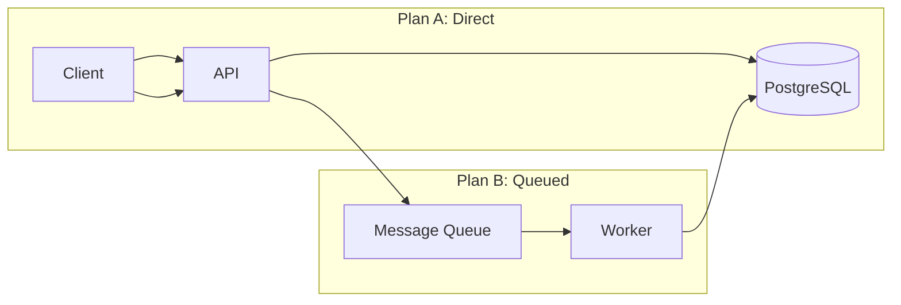
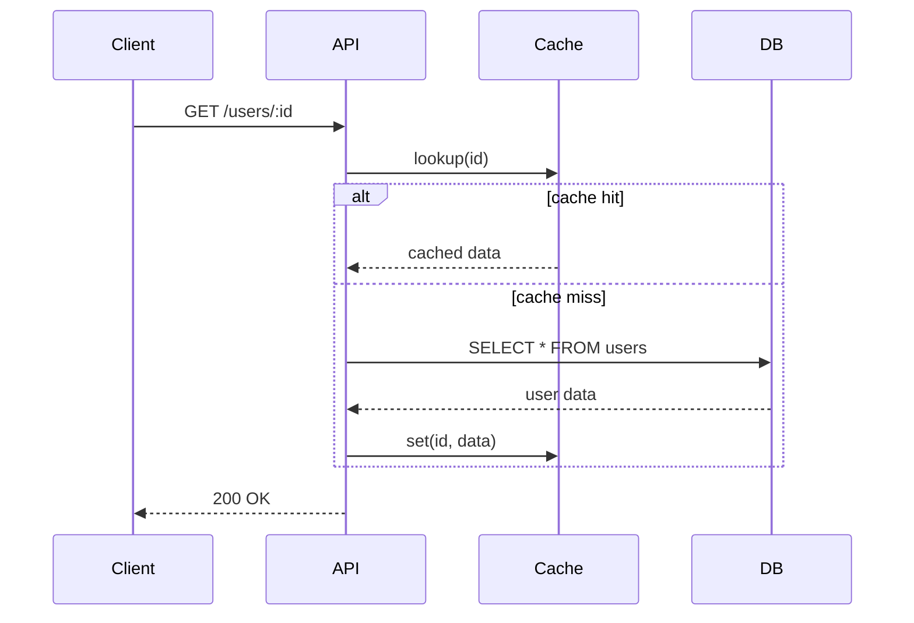
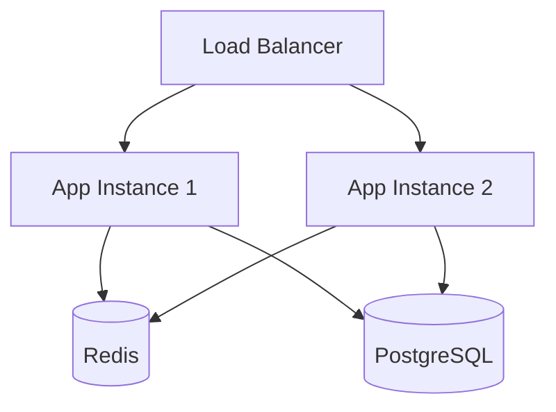

# Plan Brainstorm Skill

## Core Philosophy

Brainstorming is not about rushing to an answer — it is about exploring the problem space thoroughly before converging on a solution. The quality of the final decision is directly proportional to the depth of questions asked, concerns surfaced, and trade-offs examined during the brainstorming phase. This skill ensures no stone is left unturned.

---

## Quick Reference

| Element | Requirement |
|---|---|
| **When NOT to use** | Obvious answer, user already decided, trivial single-option, purely informational, time-sensitive emergency |
| **Minimum per plan** | 5+ pros (with impact), 5+ cons (with severity), 3+ concerns, risk profile, verification strategy |
| **Session flow** | Question → Reflect → Generate (2-3 plans) → Compare → Decision → Hand-off |
| **Concern categories** | Scalability, Reliability, Security, Operability, Cost, Time-to-Market, Technical Debt, Observability |
| **Always include** | Comparative matrix, verification strategy (rollback triggers + execution), mermaid diagram when architecture differs |

---

## Hard Rules

- ❌ NEVER present a plan without first asking at least 3 deep questions.
- ❌ NEVER present a single plan — always offer at least 2 distinct approaches.
- ❌ NEVER list fewer than 5 pros and 5 cons per plan.
- ❌ NEVER surface fewer than 3 concerns per plan.
- ❌ NEVER skip the comparative matrix when multiple plans are offered.
- ❌ NEVER skip structured tables (pros, cons, concerns, comparison matrix, strategic fit, risk profile, verification) even if the user says "keep it simple". Pick simpler approaches, not simpler analysis.
- ❌ NEVER confuse rollback triggers (conditions) with rollback execution (steps) — provide both.
- ❌ NEVER use this skill for obvious answers, already-decided approaches, or purely informational requests (see When NOT to Use).
- ✅ ALWAYS include a mermaid diagram when plans differ at the architecture/component level.
- ✅ ALWAYS include verification strategy with both rollback triggers and rollback execution for each plan.
- ✅ ALWAYS end by asking the user which direction to proceed.
- ✅ ALWAYS offer the weighted decision matrix if the user is stuck (see `references/advanced-tools.md`).
- ✅ ALWAYS offer to hybridize plans if the user is unsure (see `references/advanced-tools.md`).
- ✅ ALWAYS explicitly offer to pivot to new plans if the user rejects all presented options.

---

## When NOT to Use This Skill

This skill is designed for non-trivial technical decisions with legitimate alternatives. Do NOT use it when:

- **The answer is obvious** — The user is asking a simple yes/no question with a clear best practice.
- **The user has already decided** — They've explicitly stated their chosen approach and are asking for implementation help, not strategic input.
- **Trivial single-option tasks** — The task has only one reasonable implementation path.
- **Purely informational requests** — The user is asking for facts, documentation, or definitions, not a decision between approaches.
- **Time-sensitive emergencies** — The system is down and they need a fix now, not a strategic comparison.

If you're unsure whether brainstorming is needed, ask: "Do you want me to walk through the options with you, or would you prefer I go straight to implementing a specific approach?"

---

## Guidelines

### 1. Deep Questioning — Challenge Everything

Before presenting any plans, probe the user's request with questions that uncover hidden complexity. Do not accept the surface-level requirement at face value.

#### Categories of Questions

**Clarifying Questions** — Eliminate ambiguity:
- "When you say 'fast response time,' what specific latency threshold do you have in mind (p50, p95, p99)?"
- "Does this feature need to work offline, or is an always-on connection assumed?"
- "Is 'user' in this context an authenticated human, an API consumer, or both?"
- "What is the expected data volume — 100 records, 1 million, or 1 billion?"

**Constraint Questions** — Surface hidden boundaries:
- "Is there a fixed budget for infrastructure costs that would rule out certain architectures?"
- "What is the team's existing expertise — are they comfortable with Kafka, or would Redis streams be safer?"
- "Are there compliance requirements (SOC2, HIPAA, GDPR) that dictate where data can be stored or how it must be logged?"
- "What is the migration tolerance — can we break the existing API, or must it be backward-compatible?"

**Risk Probe Questions** — Expose potential failure modes:
- "What happens if this service is down for 5 minutes? For 1 hour?"
- "What is the blast radius if a bad deployment goes out — does it affect other services?"
- "Have we considered what happens when the third-party API we depend on rate-limits us or changes its contract?"
- "If this feature fails silently, how long until we detect it? What is our detection mechanism?"

**Stakeholder Questions** — Uncover unspoken needs:
- "Who is the primary consumer of this feature — end users, internal teams, or automated systems?"
- "Is there a specific deadline or milestone driving the timeline?"
- "Has any prior attempt at this feature been made? What went wrong?"

#### Question Quality

Good questions share these traits:
- **Open-ended** — Cannot be answered with yes/no. Require explanation.
- **Specific** — Reference concrete metrics, technologies, or scenarios.
- **Probe unstated assumptions** — Challenge what the user has taken for granted.

Poor questions to avoid:
- **Yes/no closed questions** — "Do you want it to be fast?" (Everyone wants fast.)
- **Vague questions** — "What are your requirements?" (Too broad to be useful.)
- **Already-answered questions** — Re-asking something the user already stated.

---

### 2. Concern Surfacing — Proactive Risk Identification

For every plan presented, independently surface concerns that the user may not have considered. Do not wait for the user to ask "what if."

| Category | What to Look For | Example Concern |
|---|---|---|
| **Scalability** | Will the design handle 10x the expected load? | "A single-node Postgres read replica may become the bottleneck at 50k QPS. Consider read replicas or caching." |
| **Reliability** | What single points of failure exist? | "If the message broker goes down, the entire ingestion pipeline blocks. Do we have a dead-letter queue strategy?" |
| **Security** | Where could data leak or access be abused? | "The current plan passes the user ID as a URL parameter without verification — an authenticated user could enumerate other users' data." |
| **Operability** | How will the team debug and maintain this? | "There are no structured logs or metrics proposed. When this fails in production, how will the on-call engineer diagnose it?" |
| **Cost** | What is the cloud/operational cost at scale? | "Storing every raw event in S3 with no retention policy could incur $5k+/month at our projected volume." |
| **Time-to-Market** | Is there a faster path to validation? | "Building a full event-sourced system may take 3 months. A simple status column could ship in 2 days and cover 90% of use cases." |
| **Technical Debt** | What future maintenance burden is created? | "This approach creates a circular dependency between Service A and Service B. Every future change to either service will require coordinated deploys." |
| **Observability** | How will we know it's working? | "No health check endpoint or startup probe is defined. The orchestrator won't know if the service is alive." |

**Hard Rule**: For each plan presented, surface at least 3 concerns. If a plan has fewer than 3 identifiable concerns, you are not thinking hard enough.

---

### 3. Plan Structure — The Blueprint

Every brainstorming session must produce structured plans. Each proposed plan must include:
- **Goal:** A clear, concise statement of what this specific plan aims to achieve and the primary problem it solves.
- **Summary:** A high-level overview of the proposed implementation logic and architecture. Use a mermaid diagram where helpful.
- **Steps:** A high-level breakdown of technical execution. Keep this concise.
- **Concerns:** At least 3 concerns surfaced specifically for this plan.
- **Pros & Cons:** Detailed tables (at least 5 pros and 5 cons each).
- **Strategic Fit & Risk Profile:** Two-axis trade-off analysis.
- **Verification Strategy:** How to confirm this plan works.

---

### 4. Two-Axis Trade-off Analysis

#### Axis 1: Strategic Fit
| Dimension | Rating (1-10) | Rationale |
|---|---|---|
| **Speed of delivery** | X/10 | How fast can this ship? |
| **Long-term maintainability** | X/10 | How expensive is it to change in 6 months? |
| **Scalability ceiling** | X/10 | At what traffic/scale does this break? |
| **Operational complexity** | X/10 | How many moving parts to deploy, monitor, and maintain? |
| **Alignment with existing architecture** | X/10 | Does it fit or fight the current system? |

#### Axis 2: Risk Profile
| Risk | Likelihood | Impact | Mitigation |
|---|---|---|---|
| Single point of failure | High/Med/Low | High/Med/Low | Mitigation strategy |
| Third-party dependency | High/Med/Low | High/Med/Low | Fallback / circuit breaker |
| Data loss scenario | High/Med/Low | High/Med/Low | Backup / replay strategy |
| Migration complexity | High/Med/Low | High/Med/Low | Rollback plan |
| Security vulnerability | High/Med/Low | High/Med/Low | Remediation steps |

---

### 5. Detailed Pros & Cons

For every plan, provide an exhaustive list. Aim for at least 5 items on each side. If you cannot find 5 cons, re-examine the plan more critically.

#### Pro Structure
| # | Pro | Impact | Evidence / Reasoning |
|---|---|---|---|
| 1 | Title | High/Med/Low | Why this matters, backed by data or experience |

#### Con Structure
| # | Con | Severity | Mitigation / Acceptance |
|---|---|---|---|
| 1 | Title | High/Med/Low | Can we mitigate it, or must we accept it? |

**Example Pro:**
| 1 | **No new infrastructure** | High | Uses existing Postgres instance — zero additional ops burden, no new credentials, no new outage surface. |

**Example Con:**
| 1 | **Read queries will contend with write load** | High | Mitigation: promote a read replica and route read queries there. Cost: ~$50/month for a small replica. |

---

### 6. Architecture Visualization with Diagrams

Wherever a visual would clarify the trade-offs, include a mermaid diagram. Diagrams help users reason about architecture in a way that text alone cannot match.

#### When to use diagrams
- **Compare architectures** — when two plans differ at the system/component level.
- **Illustrate data flow** — when a single plan has 3+ distinct components or stages in a request lifecycle.
- **Show deployment topology** — when the plan involves multiple service instances, databases, caching layers, or load balancers.

#### Diagram types by use case

**Architecture comparison** — Show side-by-side component diagrams:


**Data flow** — Illustrate the request lifecycle end-to-end:


**Deployment topology** — Show infrastructure layering:


#### Diagram best practices
- Keep mermaid graphs small — aim for 4-8 nodes.
- Label edges to show data direction.
- Group related components into `subgraph` blocks with descriptive titles.
- Use parentheses for databases `[(...)]`, brackets for services/APIs `[...]`, and braces for queues `{...}`.

---

### 7. Comparative Matrix

When presenting multiple plans, always include a side-by-side comparison table at the end:

| Criterion | Plan A: Quick Win | Plan B: Scalable | Plan C: Event-Driven |
|---|---|---|---|
| Time to ship | 2 days | 2 weeks | 6 weeks |
| Cost at 1k users | $10/mo | $50/mo | $200/mo |
| Cost at 1M users | $500/mo | $200/mo | $400/mo |
| Ops burden | Low | Medium | High |
| Failure recovery | Manual re-run | Automatic retry | Self-healing |
| Testability | Easy | Moderate | Complex |
| Rollback complexity | Trivial | Moderate | Difficult |

Include a **Recommended Scenario** for each plan explaining when that plan is the best choice.

---

### 8. Verification Strategy

For each plan, provide concrete methods to verify it works as intended:

- **Test cases** — Specific scenarios to validate, including edge cases.
- **Success metrics** — e.g., "p95 latency < 200ms", "zero data loss on restart", "100% test coverage on the validation layer".
- **Rollback triggers** — Conditions that would cause a rollback (e.g., "If error rate exceeds 1% after deployment").
- **Rollback execution** — How to revert (e.g., "Revert the deployment to the previous version", "Disable the feature flag").

Do not confuse these two: **Rollback triggers** are the *conditions that tell you to rollback*. **Rollback execution** is the *steps to do it*. Both are required.

---

### 9. Session Flow

Follow this structured flow for every brainstorming session:

```
Phase 1: Deep Questioning ──► Ask 3-5 probing questions (Clarifying, Constraint, Risk, Stakeholder)
         │
Phase 2: Silent Reflection ──► Synthesize answers, identify the core tension
         │
Phase 3: Plan Generation ──► Produce 2-3 distinct plans with full analysis (Pros, Cons, Concerns, Trade-offs, Diagrams, Verification)
         │
Phase 4: Comparison ──► Side-by-side comparative matrix (use the template in Scripts section)
         │
Phase 5: User Decision ──► Ask the user to choose, hybridize, or request entirely new plans
         │
Phase 6: Formal Hand-off ──► "Shall I proceed with PlanDescriber to create a detailed roadmap for [chosen plan]?"
```

#### Handling User Responses

**When the user is unsure between plans:** See `references/advanced-tools.md` (Tool 1: Weighted Decision Matrix, Tool 2: Hybridization).

**When the user rejects all presented plans:** See `references/advanced-tools.md` (Tool 3: Pivoting).

---

## Reference Files

Load these when you need specialized guidance:

| Reference | Load When... |
|---|---|
| `references/worked-example.md` | You want to see a complete brainstorming session example (rate limiting case) |
| `references/eval-context.md` | You are in an automated eval/single-response context (evaluation pipeline) |
| `references/advanced-tools.md` | The user is stuck between plans, wants to hybridize, or rejects all options |

---

## Tooling

### Scripts

| Script | Purpose | Usage |
|---|---|---|
| `scripts/generate-brainstorm-template.ts` | Generates a structured markdown template with pre-built tables for pros/cons, strategic fit, risk profile, and verification | `ts-node <skills-dir>/scripts/plan-brainstorm/generate-brainstorm-template.ts --name=<feature> [--plans=2\|3]` |

### Related Tools (from other skills)

| Tool | Skill | Purpose |
|---|---|---|
| `generate-manifest.ts` | plan-describe | Generate a `plan-manifest.json` from brainstormed decisions |
| `verify-manifest.ts` | plan-verification | Verify implementation matches the agreed plan |
| `check-consistency.ts` | orchestration | Check project consistency after implementation |

### Workflow

After brainstorming and agreeing on a direction:
```bash
# Formalize the plan
ts-node skills/scripts/plan-describe/generate-manifest.ts --name=<feature> --out=./

# After implementation, verify compliance
ts-node skills/scripts/plan-verification/verify-manifest.ts --manifest=plan-manifests/<feature>-manifest.json --dir=./
```
