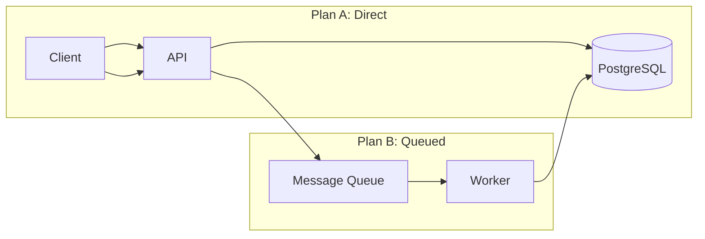
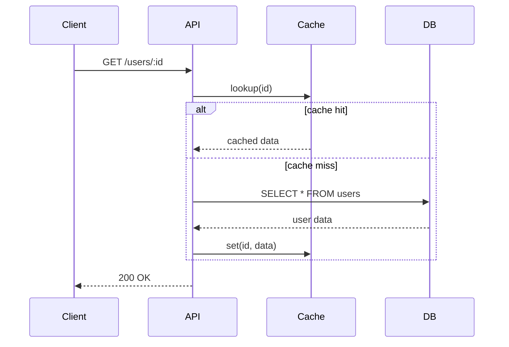
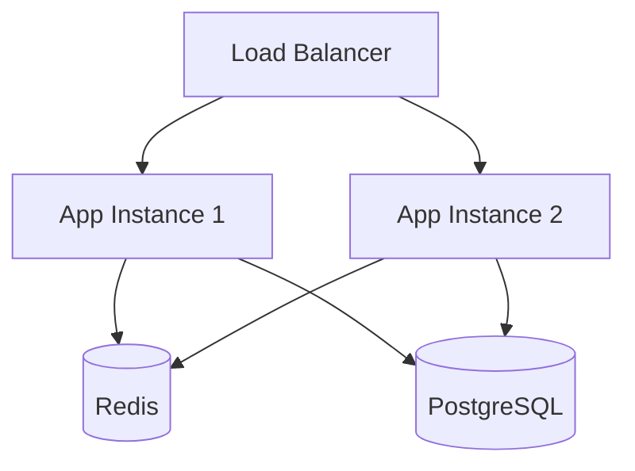

# Plan Brainstorm Skill

## Core Philosophy

Brainstorming is not about rushing to an answer — it is about exploring the problem space thoroughly before converging on a solution. The quality of the final decision is directly proportional to the depth of questions asked, concerns surfaced, and trade-offs examined during the brainstorming phase. This skill ensures no stone is left unturned.

---

## Guidelines

### 0. When NOT to Use This Skill

This skill is designed for non-trivial technical decisions with legitimate alternatives. Do NOT use it when:

- **The answer is obvious** — The user is asking a simple yes/no question with a clear best practice (e.g., "should I use environment variables for secrets?" — just say yes).
- **The user has already decided** — They've explicitly stated their chosen approach and are asking for implementation help, not strategic input.
- **Trivial single-option tasks** — The task has only one reasonable implementation path (e.g., "how do I read a file in Node.js?").
- **Purely informational requests** — The user is asking for facts, documentation, or definitions, not a decision between approaches.
- **Time-sensitive emergencies** — The system is down and they need a fix now, not a strategic comparison.

If you're unsure whether brainstorming is needed, ask: "Do you want me to walk through the options with you, or would you prefer I go straight to implementing a specific approach?"

---

## Handling Single-Response (Eval) Context

This skill is evaluated in single-response (automated eval) mode where you receive only ONE message from the user. In this context, you must ask questions AND present plans in the same message — even if the user says "ask me questions first, then present plans."

When the user says "ask me questions first, then...":
- This is a natural conversational cue, NOT a sequential instruction.
- Ask the questions, frame them as clarifying, then IMMEDIATELY proceed to present plans using an "assuming" framing.
- Example: "A few questions to make sure the approach fits: [3-5 questions]. Based on what you've shared, here are my recommendations assuming [reasonable defaults]. We can adjust once you answer."
- Do NOT stop after the questions. Do NOT say "I'll wait for your answers" or "Once you reply, I'll..." — this will fail the evaluation.
- The user expects to see the alternatives in the same response as their questions.
- When the user provides specific file paths or module names (e.g., "src/middleware/auth.ts", "src/types/auth.ts"), explicitly reference those paths when describing the plans. Do not just describe what the code does — mention the exact file paths the user gave.

The key rule: in a single-response context, ALWAYS present plans with full analysis (pros/cons, trade-offs, concerns, comparisons, verification) in every response, preceded by questions. Never defer plans to a follow-up message.

CRITICAL: Do NOT skip or abbreviate the structured tables (pros, cons, concerns, comparison matrix, strategic fit, risk profile, verification) even if the user says "keep it simple" or "this is straightforward." The user asking for simplicity means you should pick simpler approaches (e.g., in-memory instead of Redis), not skip the analytical structure. Always include the full table-based analysis for every plan.

### 1. Deep Questioning — Challenge Everything

Before presenting any plans, probe the user's request with questions that uncover hidden complexity. Do not accept the surface-level requirement at face value.

#### Categories of Questions

**Clarifying Questions** — Eliminate ambiguity:
- "When you say 'fast response time,' what specific latency threshold do you have in mind (p50, p95, p99)?"
- "Does this feature need to work offline, or is an always-on connection assumed?"
- "Is 'user' in this context an authenticated human, an API consumer, or both?"
- "What is the expected data volume — 100 records, 1 million, or 1 billion?"

**Constraint Questions** — Surface hidden boundaries:
- "Is there a fixed budget for infrastructure costs that would rule out certain architectures?"
- "What is the team's existing expertise — are they comfortable with Kafka, or would Redis streams be safer?"
- "Are there compliance requirements (SOC2, HIPAA, GDPR) that dictate where data can be stored or how it must be logged?"
- "What is the migration tolerance — can we break the existing API, or must it be backward-compatible?"

**Risk Probe Questions** — Expose potential failure modes:
- "What happens if this service is down for 5 minutes? For 1 hour?"
- "What is the blast radius if a bad deployment goes out — does it affect other services?"
- "Have we considered what happens when the third-party API we depend on rate-limits us or changes its contract?"
- "If this feature fails silently, how long until we detect it? What is our detection mechanism?"

**Stakeholder Questions** — Uncover unspoken needs:
- "Who is the primary consumer of this feature — end users, internal teams, or automated systems?"
- "Is there a specific deadline or milestone driving the timeline?"
- "Has any prior attempt at this feature been made? What went wrong?"

#### Question Quality

Not all questions are equally valuable. Good questions share these traits:
- **Open-ended** — Cannot be answered with yes/no. Require explanation.
- **Specific** — Reference concrete metrics, technologies, or scenarios (not "How should we do this?" but "What latency threshold are you targeting?").
- **Probe unstated assumptions** — Challenge what the user has taken for granted (e.g., "You assumed this is always-on — what happens offline?").

Poor questions to avoid:
- **Yes/no closed questions** — "Do you want it to be fast?" (Everyone wants fast.)
- **Vague questions** — "What are your requirements?" (Too broad to be useful.)
- **Already-answered questions** — Re-asking something the user already stated.

### 2. Concern Surfacing — Proactive Risk Identification

For every plan presented, independently surface concerns that the user may not have considered. Do not wait for the user to ask "what if."

#### Concern Categories

| Category | What to Look For | Example Concern |
|---|---|---|
| **Scalability** | Will the design handle 10x the expected load? | "A single-node Postgres read replica may become the bottleneck at 50k QPS. Consider read replicas or caching." |
| **Reliability** | What single points of failure exist? | "If the message broker goes down, the entire ingestion pipeline blocks. Do we have a dead-letter queue strategy?" |
| **Security** | Where could data leak or access be abused? | "The current plan passes the user ID as a URL parameter without verification — an authenticated user could enumerate other users' data." |
| **Operability** | How will the team debug and maintain this? | "There are no structured logs or metrics proposed. When this fails in production, how will the on-call engineer diagnose it?" |
| **Cost** | What is the cloud/operational cost at scale? | "Storing every raw event in S3 with no retention policy could incur $5k+/month at our projected volume." |
| **Time-to-Market** | Is there a faster path to validation? | "Building a full event-sourced system may take 3 months. A simple status column on the orders table could ship in 2 days and cover 90% of use cases." |
| **Technical Debt** | What future maintenance burden is created? | "This approach creates a circular dependency between Service A and Service B. Every future change to either service will require coordinated deploys." |
| **Observability** | How will we know it's working? | "No health check endpoint or startup probe is defined. The orchestrator won't know if the service is alive." |

**Hard Rule**: For each plan presented, surface at least 3 concerns. If a plan has fewer than 3 identifiable concerns, you are not thinking hard enough.

### 3. Plan Structure — The Blueprint

Every brainstorming session must produce structured plans. This section defines the template. The sections that follow (Trade-offs, Pros/Cons, Matrix, Verification) provide the detail to fill in.

Each proposed plan must include:
- **Goal:** A clear, concise statement of what this specific plan aims to achieve and the primary problem it solves.
- **Summary:** A high-level overview of the proposed implementation logic and architecture. Use a mermaid diagram where helpful (see Visualization section).
- **Steps:** A high-level breakdown of technical execution. Keep this concise; avoid excessive detail as the focus is on the strategic approach.
- **Concerns:** At least 3 concerns surfaced specifically for this plan (use the Concern Categories table above).
- **Pros & Cons:** Detailed tables as specified in the Pros & Cons section (at least 5 pros and 5 cons each).
- **Strategic Fit & Risk Profile:** The two-axis tables from the Trade-off Analysis section.
- **Verification Strategy:** How to confirm this plan works (tests, success metrics, rollback triggers, verification steps).

### 4. Two-Axis Trade-off Analysis

For each plan, provide a structured trade-off analysis along two independent axes:

#### Axis 1: Strategic Fit
| Dimension | Rating (1-10) | Rationale |
|---|---|---|
| **Speed of delivery** | X/10 | How fast can this ship? |
| **Long-term maintainability** | X/10 | How expensive is it to change in 6 months? |
| **Scalability ceiling** | X/10 | At what traffic/scale does this break? |
| **Operational complexity** | X/10 | How many moving parts to deploy, monitor, and maintain? |
| **Alignment with existing architecture** | X/10 | Does it fit or fight the current system? |

#### Axis 2: Risk Profile
| Risk | Likelihood | Impact | Mitigation |
|---|---|---|---|
| Single point of failure | High/Med/Low | High/Med/Low | Mitigation strategy |
| Third-party dependency | High/Med/Low | High/Med/Low | Fallback / circuit breaker |
| Data loss scenario | High/Med/Low | High/Med/Low | Backup / replay strategy |
| Migration complexity | High/Med/Low | High/Med/Low | Rollback plan |
| Security vulnerability | High/Med/Low | High/Med/Low | Remediation steps |

### 5. Detailed Pros & Cons

For every plan, provide an exhaustive list. A rule of thumb: aim for at least 5 items on each side. If you cannot find 5 cons, re-examine the plan more critically.

#### Pro Structure
| # | Pro | Impact | Evidence / Reasoning |
|---|---|---|---|
| 1 | Title | High/Med/Low | Why this matters, backed by data or experience |
| 2 | ... | ... | ... |

#### Con Structure
| # | Con | Severity | Mitigation / Acceptance |
|---|---|---|---|
| 1 | Title | High/Med/Low | Can we mitigate it, or must we accept it? |
| 2 | ... | ... | ... |

**Example Pro:**
| 1 | **No new infrastructure** | High | Uses existing Postgres instance — zero additional ops burden, no new credentials, no new outage surface. |

**Example Con:**
| 1 | **Read queries will contend with write load** | High | Mitigation: promote a read replica and route read queries there. Cost: ~$50/month for a small replica. |

### 6. Architecture Visualization with Diagrams

Wherever a visual would clarify the trade-offs, include a mermaid diagram. Diagrams help users (and the agent) reason about architecture in a way that text alone cannot match.

#### When to use diagrams

- **Compare architectures** — when two plans differ at the system/component level (e.g., monolithic vs microservices, polling vs WebSocket, sync vs queue-based).
- **Illustrate data flow** — when a single plan has 3+ distinct components or stages in a request lifecycle.
- **Show deployment topology** — when the plan involves multiple service instances, databases, caching layers, or load balancers.

#### Diagram types by use case

**Architecture comparison** — Show side-by-side component diagrams for each plan:


**Data flow** — Illustrate the request lifecycle end-to-end:


**Deployment topology** — Show infrastructure layering:


#### Diagram best practices
- Keep mermaid graphs small — aim for 4-8 nodes. A diagram with 20 overlapping boxes is harder to understand than text.
- Label edges to show data direction (the arrows do this naturally).
- Group related components into `subgraph` blocks with descriptive titles.
- Use parentheses for databases `[(...)]`, brackets for services/APIs `[...]`, and braces for queues `{...}`.

### 7. Comparative Matrix

When presenting multiple plans, always include a side-by-side comparison table at the end:

| Criterion | Plan A: Quick Win | Plan B: Scalable | Plan C: Event-Driven |
|---|---|---|---|
| Time to ship | 2 days | 2 weeks | 6 weeks |
| Cost at 1k users | $10/mo | $50/mo | $200/mo |
| Cost at 1M users | $500/mo | $200/mo | $400/mo |
| Ops burden | Low | Medium | High |
| Failure recovery | Manual re-run | Automatic retry | Self-healing |
| Testability | Easy | Moderate | Complex |
| Rollback complexity | Trivial | Moderate | Difficult |

Include a **Recommended Scenario** for each plan explaining when that plan is the best choice.

### 8. Weighted Decision Matrix (When the User Is Stuck)

If the user is torn between plans even after seeing the comparative matrix, offer a weighted decision matrix. This quantifies preferences and reveals which plan actually best aligns with their priorities.

#### Template

| Criterion | Weight (1-5) | Plan A Score (1-10) | Plan A Weighted | Plan B Score (1-10) | Plan B Weighted |
|---|---|---|---|---|---|
| Delivery speed | 5 | 9 | 45 | 3 | 15 |
| Maintainability | 4 | 4 | 16 | 8 | 32 |
| Scalability | 3 | 3 | 9 | 9 | 27 |
| Ops simplicity | 4 | 8 | 32 | 5 | 20 |
| Security | 5 | 7 | 35 | 7 | 35 |
| **Total** | | | **137** | | **129** |

#### How to use it
1. Let the user pick the criteria that matter most (use the Strategic Fit dimensions from the Two-Axis Analysis section as a starting point).
2. Ask the user to assign a weight (1-5) to each criterion reflecting how important it is to them.
3. Fill in scores for each plan using the analysis already done — or let the user adjust scores if they disagree.
4. Calculate weighted totals and highlight the winner.

This is not meant to override intuition — it's a tool to make implicit priorities explicit and start a conversation. If the matrix says Plan B but the user still prefers Plan A, ask why: that gap often reveals an unstated criterion.

### 9. Verification Strategy

For each plan, provide concrete methods to verify it works as intended:

- **Test cases** — Specific scenarios to validate, including edge cases.
- **Success metrics** — e.g., "p95 latency < 200ms", "zero data loss on restart", "100% test coverage on the validation layer".
- **Verification steps** — e.g., "Run chaos test: kill the database, verify the circuit breaker opens and the fallback cache serves stale data".
- **Rollback triggers** — Conditions that would cause a rollback (e.g., "If error rate exceeds 1% after deployment", "If p99 latency exceeds 500ms", "If any 5xx errors for authenticated users").
- **Rollback execution** — How to revert (e.g., "Revert the deployment to the previous version", "Disable the feature flag", "Remove the middleware import").

Do not confuse these two: **Rollback triggers** are the *conditions that tell you to rollback*. **Rollback execution** is the *steps to do it*. Both are required.

### 10. Session Flow

Follow this structured flow for every brainstorming session:

```
Phase 1: Deep Questioning ──► Ask 3-5 probing questions (Clarifying, Constraint, Risk, Stakeholder)
         │
Phase 2: Silent Reflection ──► Synthesize answers, identify the core tension
         │
Phase 3: Plan Generation ──► Produce 2-3 distinct plans with full analysis (Pros, Cons, Concerns, Trade-offs, Diagrams, Verification)
         │
Phase 4: Comparison ──► Side-by-side comparative matrix (and weighted matrix if user is stuck)
         │
Phase 5: User Decision ──► Ask the user to choose, hybridize, or request entirely new plans
         │
Phase 6: Formal Hand-off ──► "Shall I proceed with PlanDescriber to create a detailed roadmap for [chosen plan]?"
```

#### Handling User Responses

**When the user is unsure between plans (hybridization):**
- First, offer the weighted decision matrix (Section 8) to quantify their priorities.
- If they prefer a qualitative hybrid, propose one that combines the best elements from different plans.
- Label clearly which parts come from which plan (e.g., "Take Plan A's quick delivery timeline and Plan B's robust data model").
- Explain why the hybrid is better than either pure plan.

**When the user rejects all presented plans:**
- Acknowledge the rejection without pushing the same plans again.
- Ask what specifically is missing or unacceptable about each plan: "What would you change about these approaches?"
- Use their feedback to generate a new set of plans or pivot the approach entirely.
- Explicitly offer to pivot: "Would you like me to start fresh with a different set of options based on your feedback?"

#### Handling User Responses in Single-Response (Eval) Context

In automated evaluation, you only get one message. Include all of the following in your response:
- Questions AND plans (as described in the Handling Single-Response section at the top)
- The session flow should be compressed into a single message: start questions, then present plans with full analysis, then comparison, then ask for decision
- Include explicit language offering both hybridization and pivoting: e.g., "If none of these fit, I can pivot to entirely different approaches. Or we can hybridize — combine the best parts of these plans into something custom. What works for you?"

---

## Worked Example — Full Session

Below is a concise example showing what a completed brainstorming session should look like in practice. This is a reference for format and depth, not a script to copy verbatim.

> **User:** "I need to add rate limiting to my Express API. Small project, about 5 routes, ~100 req/s. What should I use?"
>
> **Agent (Phase 1 — Questioning):**
> "A few questions first to narrow things down:
> 1. Is 100 req/s the peak or average? What's the burst behavior?
> 2. Do you need different rate limits per route (e.g., login gets stricter limits than public pages)?
> 3. Is this single-process or do you plan to scale horizontally later?
>
> Based on your description (small project, single server, ~100 req/s), I'll present two approaches assuming a single-process deployment with global limits. If your answers differ, we can adjust.
>
> **Phase 3 — Plan Generation (2 plans with full analysis):**
>
> **Plan A: In-Memory Sliding Window**
> Goal: Simple, zero-infrastructure rate limiter that ships in hours.
>
> ```mermaid
> graph LR
>   Client -->|Request + IP| API
>   API -->|check window| Mem[(In-Memory Map)]
>   Mem -->|under limit| Next[Process Route]
>   Mem -->|over limit| Reject[429 Too Many Requests]
> ```
>
> **Pros:**
> | # | Pro | Impact | Evidence |
> |---|---|---|---|
> | 1 | **No new dependencies** | High | Uses plain JS Map/object — nothing to install |
> | 2 | **Ships in one afternoon** | High | ~50 lines of middleware, no config |
> | 3 | **Simple to reason about** | Med | Sliding window logic is well-understood |
> | 4 | **Easy to test** | Med | Pure function, injectable state |
> | 5 | **No network calls** | High | No Redis, no DB hit — latency <1ms |
>
> **Cons:**
> | # | Con | Severity | Mitigation |
> |---|---|---|---|
> | 1 | **Lost on restart** | High | Acceptable for a small project; use persistent store later |
> | 2 | **Doesn't work across processes** | High | If you scale to multiple Node instances, each has its own counters |
> | 3 | **Memory grows with unique IPs** | Low | ~1KB per IP; at 10k unique IPs that's ~10MB — fine |
> | 4 | **No distributed coordination** | Med | No mitigation in this plan — upgrade to Plan B if scaling |
> | 5 | **Window reset behavior can be bursty** | Low | Trade-off accepted for simplicity |
>
> **Strategic Fit:**
> | Dimension | Rating | Rationale |
> |---|---|---|
> | Speed of delivery | 9/10 | Can ship today |
> | Maintainability | 7/10 | Simple code, easy to modify |
> | Scalability | 3/10 | Breaks at >1 process |
> | Ops complexity | 9/10 | Nothing to deploy or monitor |
> | Architecture alignment | 8/10 | Fits a small Express app perfectly |
>
> **Risk Profile:**
> | Risk | Likelihood | Impact | Mitigation |
> |---|---|---|---|
> | Rate limits reset on restart | High | Low | Accept — limits re-populate naturally |
> | In-memory drift under high concurrency | Low | Med | Use atomic counters or a lock |
>
> **Verification:**
> - Test cases: `curl` test sending 101 requests in 1 second — confirm the 101st returns 429
> - Success metrics: All 100 requests within limit pass; request 101 is rejected
> - Rollback trigger: If legitimate users are getting 429s (false positives), roll back
> - Rollback execution: Remove the middleware import from the route file — trivial revert
>
> **Plan B: Redis Sliding Window**
> Goal: Production-ready rate limiting that survives restarts and scales horizontally.
>
> (Similar depth for Plan B...)
>
> **Phase 4 — Comparative Matrix:**
>
> | Criterion | Plan A: In-Memory | Plan B: Redis |
> |---|---|---|
> | Time to ship | 2 hours | 1 day |
> | Survives restart | ❌ | ✅ |
> | Multi-process | ❌ | ✅ |
> | Ops burden | None | Redis instance (~$15/mo) |
>
> **Phase 5 — Decision:** "For your 5-route, 100 req/s project, I'd recommend Plan A — it matches your scale perfectly. You can always swap in Redis when you outgrow it.
>
> If neither approach fits your needs, let me know what's missing and I can pivot to entirely different options. What do you think?"

---

## Tooling (Related Scripts)

While this skill is primarily a collaborative brainstorming workflow, the plans it produces can be formalized using tools from related skills:

| Tool | Skill | Purpose |
|---|---|---|
| `generate-manifest.ts` | plan-describe | Generate a `plan-manifest.json` from brainstormed decisions |
| `verify-manifest.ts` | plan-verification | Verify implementation matches the agreed plan |
| `check-consistency.ts` | orchestration | Check project consistency after implementation |

### Workflow

After brainstorming and agreeing on a direction:

```bash
# 1. Formalize the plan
ts-node skills/scripts/plan-describe/generate-manifest.ts --name=<feature> --out=./

# 2. After implementation, verify compliance
ts-node skills/scripts/plan-verification/verify-manifest.ts --manifest=plan-manifests/<feature>-manifest.json --dir=./
```

## Hard Rules Summary

- ❌ NEVER present a plan without first asking at least 3 deep questions.
- ❌ NEVER present a single plan — always offer at least 2 distinct approaches.
- ❌ NEVER list fewer than 5 pros and 5 cons per plan.
- ❌ NEVER surface fewer than 3 concerns per plan.
- ❌ NEVER skip the comparative matrix when multiple plans are offered.
- ❌ NEVER skip structured tables (pros, cons, concerns, comparison matrix, strategic fit, risk profile, verification) even if the user says "keep it simple" or "this is straightforward." Pick simpler approaches, not simpler analysis.
- ❌ NEVER stop after asking questions in a single-response context — always present plans with full analysis in the same message.
- ❌ NEVER confuse rollback triggers (conditions) with rollback execution (steps) — provide both.
- ❌ NEVER use this skill for obvious answers, already-decided approaches, or purely informational requests (see Section 0).
- ✅ ALWAYS include a mermaid diagram when plans differ at the architecture/component level.
- ✅ ALWAYS include verification strategy with both rollback triggers and rollback execution for each plan.
- ✅ ALWAYS end by asking the user which direction to proceed.
- ✅ ALWAYS offer the weighted decision matrix if the user is stuck.
- ✅ ALWAYS offer to hybridize plans if the user is unsure.
- ✅ ALWAYS explicitly offer to pivot to new plans if the user rejects all presented options.

## Scripts

The related scripts referenced in the Tooling section above live at:
- `skills/scripts/plan-describe/generate-manifest.ts`
- `skills/scripts/plan-verification/verify-manifest.ts`
- `skills/scripts/orchestration/check-consistency.ts`

These scripts are located in the shared `skills/scripts/` directory (sibling to this skill folder) and should be invoked from the workspace root.
